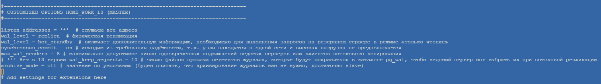
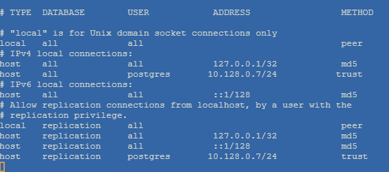
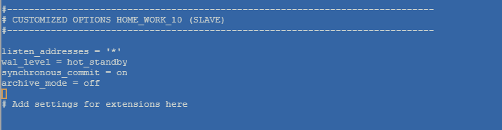
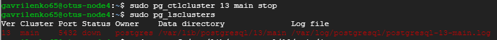
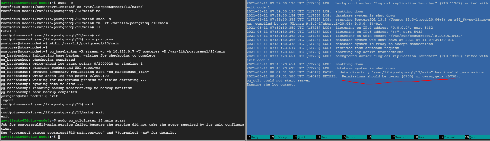
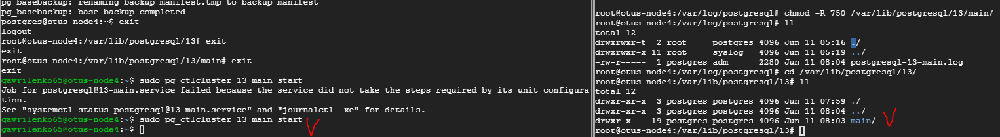
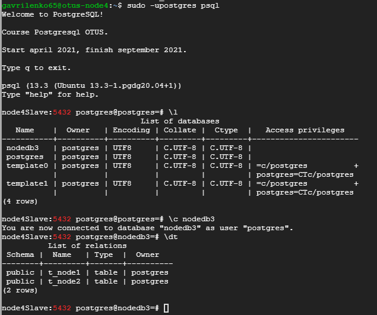
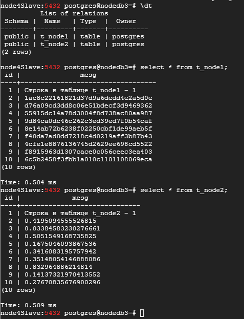

## Домашнее задание № 7 (Репликация PostgreSQL )

Подготовим стенд для выполнения ДЗ со следующими характеристиками:

* otus-node1 (Ubuntu 20.04, PostgreSQL 13)  
* otus-node2 (Ubuntu 20.04, PostgreSQL 13)
* otus-node3 (Ubuntu 20.04, PostgreSQL 13)
* otus-node4Slave (Ubuntu 20.04, PostgreSQL 13)

 
1. Настроим логическую репликацию. Создадим БД и таблицы в <b>nodedb1</b> и <b>nodedb2</b>:

* На <b>otus-node1</b>:

 `alter system set wal_level = logical;  //включаем логическую репликацию`
 
 `sudo pg_ctlcluster 13 main restart  //не забываем рестартовать кластер для применения изменений`
 
 `create database nodedb1;`
 
 `\c nodedb1`  
 
 `create table t_node1(id integer, mesg varchar(50));` 
 
 `create table t_node2(id integer, mesg varchar(50));`
 
  
  
* На <b>otus-node2</b>:

 
 
2. Сделаем перекрёстную публикацию/подписку на эти таблиц:

* На <b>otus-node1</b>:

Опубликуем таблицу <b>t_node1</b>:

 `CREATE PUBLICATION t_node1_pub FOR TABLE t_node1;`
 
 `\dRp+  //проверим, что наша публикация состоялась`
 
 `\password //назначим пароль для нашей логической репликации` - <b>otus123</b>
 
 
 
* На <b>otus-node2</b>:

Проделаем тоже самое с таблицей <b>t_node2</b>:

 
 
3. Таблицы опубликованы. Теперь оформим подписку с кластера <b>otus-node1</b> на таблицу <b>t_node2</b> на кластере <b>otus-node2</b>:

Для начала пропишем правила в <b>firewall</b> для трёх портов (чтобы два раза не бегать):

 `gcloud compute firewall-rules create replica --allow tcp:5432 --source-ranges=0.0.0.0/0 --description="postgresql"`  
 `gcloud compute firewall-rules create replica1 --allow tcp:5433 --source-ranges=0.0.0.0/0 --description="postgresql1"`  
 `gcloud compute firewall-rules create replica2 --allow tcp:5434 --source-ranges=0.0.0.0/0 --description="postgresql2"`

Изменим параметр в файле <b>postgres.conf</b>, чтобы кластер слушал все адреса:

`listen_addresses = '*'`

Разрешим удалённое подключение всем пользователям с любых адресов к кластеру по паролю:

`host    all     all    0.0.0.0/0     md5`  
`host    all     all         ::/0     md5`

Подпишемся:

 `CREATE SUBSCRIPTION t_node2_sub CONNECTION 'host=10.128.0.6 port=5432 user=postgres password=otus123 dbname=nodedb2' PUBLICATION t_node2_pub WITH (copy_data = false);`
 
 Проверим статус:

 `SELECT * FROM pg_stat_subscription \gx`
 
 
 
 
4. Теперь оформим подписку с кластера <b>otus-node2</b> на таблицу <b>t_node1</b> на кластере <b>otus-node1</b>:

`CREATE SUBSCRIPTION t_node1_sub CONNECTION 'host=10.128.0.5 port=5432 user=postgres password=otus123 dbname=nodedb1' PUBLICATION t_node1_pub WITH (copy_data = false);`  

`SELECT * FROM pg_stat_subscription \gx`

На каждом узле вставим по одной строке в таблицы:

| <b>node1</b>          | <b>node2</b>  |
| :------------ |:---------------|
| `insert into t_node1 values (1, 'Строка в таблице t_node1 - 1');`         |  `insert into t_node2 values (1, 'Строка в таблице t_node2 - 1');`        |

Сделаем запрос к обоим таблицам и убедимся, что данные, доступные на двух узлах, идентичные:

`select * from t_node1 a, t_node2 b`  
`where`  
`a.id = b.id;`

На первом узле (<b>node1</b>) вставим ещё несколько строк только в таблицу <b>t_node1</b> и обратимся к ней на втором узле (<b>node2</b>):

 `insert into t_node1 values (generate_series(2,10),md5(random()::text));`
 
 
 
Теперь, на втором узле (<b>node2</b>), вставим несколько строк в таблицу <b>t_node2</b> и обратимся к ней с первого узла (<b>node1</b>):

`insert into t_node2 values (generate_series(2,10),(random()::text));`

### Репликационные идентификаторы

>Весь процесс логической репликации в принципе строится на идее репликационных идентификаторов. Поэтому дальнейшая подготовка состоит в проверке наличия во всех реплицируемых таблицах либо первичного ключа, либо индекса, соответствующего некоторым минимальным требованиям и задействованного в REPLICA IDENTITY USING INDEX, либо назначении REPLICA IDENTITY FULL. То есть проверка наличия в таблицах репликационных идентификаторов. Они нужны для однозначной идентификации изменяемых или удаляемых строк при репликации команд UPDATE и DELETE и передаются на реплику в специальном поле для каждой записи.  
Репликационные идентификаторы можно не настраивать, или даже отключить, если планируется реплицировать только команды INSERT. Главное не забыть правильно создать публикацию — исключить из неё команды UPDATE и DELETE. Но если вам на реплике нужны актуальные данные из активно изменяющихся таблиц, а первичные ключи или уникальные NOT NULL индексы в таблицах отсутствуют, то репликационные идентификаторы придётся настраивать с нуля. Не выполнив это условие, можно добиться того, что UPDATE и DELETE будут приводить к отмене транзакций на мастере, малоприятный факт на рабочей базе.  

Чтобы потом не запутаться создадим индексы (пока поле <b>id</b> уникально):

`create unique index on t_node1 (id); //На node1`  
`create unique index on t_node2 (id); //На node2`

Как видим, логическая (перекрёстная) репликация между <b>node1</b> и <b>node2</b> работает.  
Теперь переходим к третьему узлу - <b>node3</b>.

5. Прежде чем подписаться, необходимо создать объекты - логическая репликация не работает с <b>DDL</b>. Пробуем подписаться без создания таблиц:

 `CREATE SUBSCRIPTION t_node1_3_sub CONNECTION 'host=10.128.0.5 port=5432 user=postgres password=otus123 dbname=nodedb1' PUBLICATION t_node1_pub WITH (copy_data = false);`
 
Как видим, получаем ошибку, что таблица (<b>relation</b>) не существует:

Создадим таблицы и оформим подписку:

`create table t_node1(id integer, mesg varchar(50));` 
 
`create table t_node2(id integer, mesg varchar(50));`

`CREATE SUBSCRIPTION t_node1_3_sub CONNECTION 'host=10.128.0.5 port=5432 user=postgres password=otus123 dbname=nodedb1' PUBLICATION t_node1_pub WITH (copy_data = false);`

`CREATE SUBSCRIPTION t_node2_3_sub CONNECTION 'host=10.128.0.6 port=5432 user=postgres password=otus123 dbname=nodedb2' PUBLICATION t_node2_pub WITH (copy_data = false);`

Сделаем выборку данных из таблиц на третьей ноде (<b>node3</b>):

`select * from t_node1;`  
`select * from t_node2;`

И... ничего не получаем - таблицы пустые!

Почему так произошло? Причина - параметр <b>copy_data = false</b>:

>copy_data (boolean)  
Определяет, должны ли копироваться существующие данные в публикациях, на которые оформляется подписка, сразу после начала репликации. Значение по умолчанию — true.

<i>Т.е. этот параметр сообщает - нужно ли копировать существующие данные (те, которые были в таблицах до создания подписки)</i>

Пересоздадим наши подписки с условием получения всех данных:

`drop subscription t_node1_3_sub;`  
`drop subscription t_node2_3_sub;`   

`CREATE SUBSCRIPTION t_node1_3_sub CONNECTION 'host=10.128.0.5 port=5432 user=postgres password=otus123 dbname=nodedb1' PUBLICATION t_node1_pub WITH (copy_data = true);`  
`CREATE SUBSCRIPTION t_node2_3_sub CONNECTION 'host=10.128.0.6 port=5432 user=postgres password=otus123 dbname=nodedb2' PUBLICATION t_node2_pub WITH (copy_data = true);`  

### pg_basebackup

6. Настроим на <b>node3</b> периодический бэкап (по расписанию) наших баз <b>node1</b> и <b>node2</b>:

Внесём изменения в pg_hba.conf на <b>node1</b> и <b>node2</b>, разрешающее репликационное соединение пользователю <b>postgres</b> (без требования ввода пароля) с узла <b>node3</b> для работы программы <b>pg_basebackup</b>:

`host replication postgres 10.128.0.7/32 trust`

Создадим директории для хранения наших бэкапов:

 `$ mkdir /home/backup`  
 `$ mkdir /home/backup/node1`  
 `$ mkdir /home/backup/node2`  
 
Напишем небольшие скрипты (<i>backup_node1.sh</i> и <i>backup_node2.sh</i>) для выполнения бэкапа (для <b>node1</b> и <b>node2</b>):

`#!/bin/bash`  
`NOW=$(date +'%d-%m-%Y'_'%H:%M:%S')`  
`DATA='%m-%d-%Y'`  
`pg_basebackup -X stream -v -h 10.128.0.5 -U postgres -D /home/backup/node1/node1_$NOW`

<i>Скрипт создаёт бэкап нашего кластера в указанной директории с именем узла и временем выполнения</i>

Сделаем их выполняемыми:

`chmod +x backup_node1.sh`  
`chmod +x backup_node2.sh`

Добавим их в cron для ежедневного выполнения (например, в 1:30 и 2:30 ночи):

`30 1 * * * ~/backup_node1.sh`  
`30 2 * * * ~/backup_node1.sh`

...и добавим удаление бэкапов старше 7 дней:

`find /home/backup/node1 -type d -mtime +7 -print0 | xargs -0 rm -r`
`find /home/backup/node2 -type d -mtime +7 -print0 | xargs -0 rm -r`

Бэкапы настроены:

### hot replication

Передача wal на реплику (node4Slave)

7. На отдельном узле (<b>node4</b>) создадим слэйв нашего третьего узла (<b>node3</b>) с возможностью чтения (<i>hot_standby</i>):

* создадим новую ВМ <b>otus-node4</b> и установим <b>PostgreSQL</b>

* подготовим наш мастер <b>node3</b>

  - Изменим <b>/etc/postgresql/13/main/pg_hba.conf</b>, разрешив принимать соединения для работы <b>pg_basebackup</b> и <b>pg_rewind</b>:

 `host    replication      postgres       10.128.0.8/24            trust   //Чтобы не вводить пароль`  
 `host    all              postgres       10.128.0.8/24            trust`
 
  - Изменим <b>/etc/postgresql/13/main/postgresql.conf</b>:

 `listen_addresses = '*'  # слушаем все адреса`  
 `wal_level = hot_standby  # включает дополнительную информацию, необходимую для выполнения запросов на резервном сервере в режиме «только чтение»`  
 `synchronous_commit = on # исходим из требования надёжности, т.к. узлы находятся в одной сети и высокая нагрузка не предполагается`  
 `# !!! Нет в 13 версии wal_keep_segments = 10 # число файлов прошлых сегментов журнала, которые будут сохраняться в каталоге pg_wal, чтобы ведомый сервер мог выбрать их при потоковой репликации`  
 `archive_mode = off # значение по умолчанию (будем считать, что архивирование журналов нам не нужно, достаточно slave)`  
 `max_replication_slots = 20`
 

 
* подготовим <b>slave - node4</b>

  Изменим конфигурационные файлы аналогично мастеру (с учётом адресов).
  
 
 
 
 
Останавливаем кластер <b>postgresql</b> на <b>node4Slave</b>

 
 
Удаляем папку с файлами данных <b>postgresql</b>:

 `sudo -s`
 `rm -rf /var/lib/postgresql/13/main`
 
Подключаемся пользователем <b>postgres</b>, создаём папку <b>main</b> и копируем данные с мастера:

 `su - postgres`
 `mkdir /var/lib/postgresql/13/main`
 
Копируем данные с мастера:
 
 `pg_basebackup -X stream -v -h 10.128.0.7 -U postgres -D /var/lib/postgresql/13/main`
 
Стартуем кластер и получаем ошибку (неправильные права на каталог):

Исправляем права на папку и стартуем кластер:

`chmod -R 750 /var/lib/postgresql/13/main/`

Подключимся на слэйве к БД:

Сделаем выборку из таблиц на <b>node4Slave</b>:

8. 

#### Ссылки:  
https://serverfault.com/questions/1042838/how-to-connect-datagrip-to-postgres-on-google-compute-engine  //настраиваем доступ  
https://habr.com/ru/company/postgrespro/blog/489308/  //репликационные идентификаторы  
https://postgrespro.ru/docs/postgresql/12/sql-createsubscription  //create subscription  
https://eax.me/postgresql-replication/ //потоковая репликация  
https://postgrespro.ru/docs/postgresql/13/app-pgbasebackup //pg_basebackup  
https://habr.com/ru/post/525308/ //PITR штатными средствами PostgreSQL
