## Домашнее задание № 8 (Работа с большим объемом реальных данных)

1. Подготовим VM - ssd 200Gb, PostgreSQL 13:

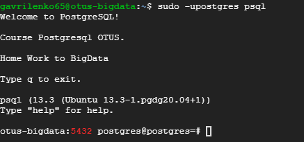

2. Экспортируем данные в Google Cloud Storage (разбив на несколько частей):

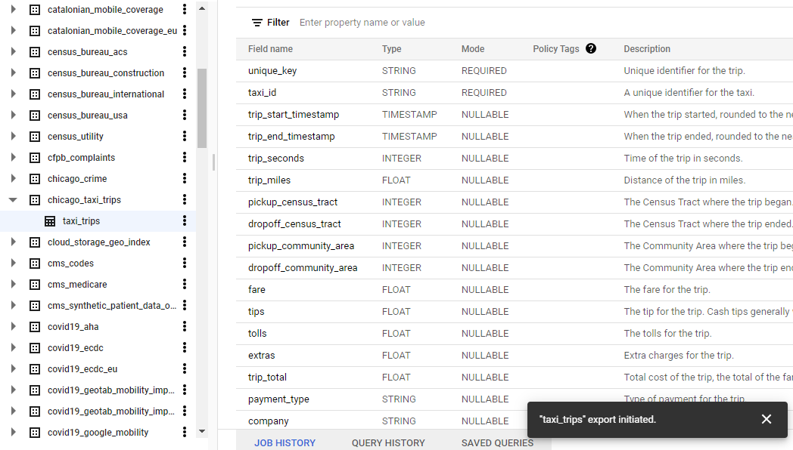

3. С помощью встроенной (есть по умолчанию в GMC) утилиты <b>gsutil</b> загрузим данные на нашу виртуальную машину:

`gsutil -m cp -R gs://otus_dz11_bigdata /home/bucket`

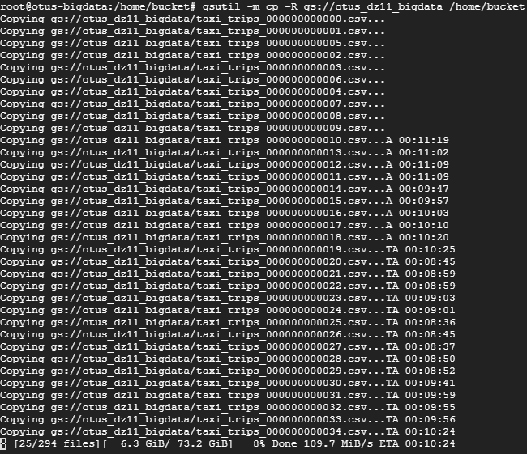

Используем данные из <i>chicago_crime</i>:

`gsutil -m cp -R gs://chic_crime_bucket /home/bucket`

Скачаем данные в <b>csv</b>, создадим БД <b>chic_crime</b> и подсоеденимся к ней:

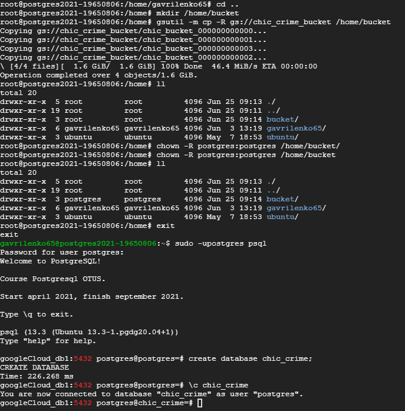

(сразу же закачаем данные на вторую машину - <b>otus-bigdata</b>) - <i>не пошло (мало места)</i>

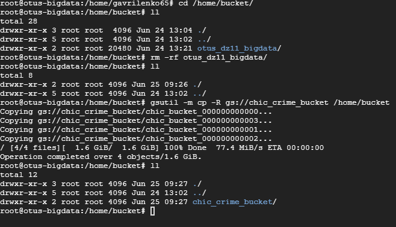

Создадим таблицу <b>crime</b> в БД <b>chic_crime</b>:

>create table crime (  
	unique_key integer,  
	case_number text,  
	date timestamp,  
	block text,  
	iucr text,  
	primary_type text,  
	description text,  
	location_description text,  
	arrest boolean,  
	domestic boolean,  
	beat integer,  
	district integer,  
	ward integer,  
	community_area integer,  
	fbi_code text,  
	x_coordinate double precision,  
	y_coordinate double precision,  
	year integer,  
	updated_on timestamp,  
	latitude double precision,  
	longitude double precision,  
	location text  
	); 
	
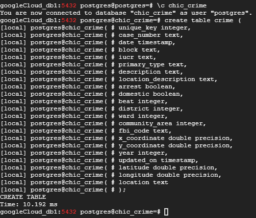

Теперь загрузим данные с помощью <b>SQL COPY</b>:

>COPY crime(unique_key,  
	case_number,  
	date,  
	block,  
	iucr,  
	primary_type,  
	description,  
	location_description,  
	arrest,  
	domestic,  
	beat,  
	district,  
	ward,  
	community_area,  
	fbi_code,  
	x_coordinate,  
	y_coordinate,  
	year,  
	updated_on,  
	latitude,  
	longitude,  
	location)  
FROM PROGRAM 'awk FNR-1 /home/bucket/chic_crime_bucket*.csv | cat' DELIMITER ',' CSV HEADER;  

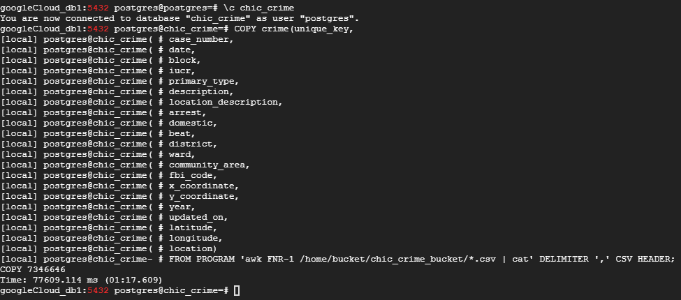

### Неудачный пример - мало данных. Возвращаемся на таблицу такси.

`gsutil -m cp -R gs://otus_taxi_bigdata /home/bucket`

Создаём БД <b>chic_taxi</b> и в ней таблицу <b>taxi_trips</b>:

`create database chic_taxi;`  

>create table taxi_trips (  
	unique_key text,   
	taxi_id text,   
	trip_start_timestamp TIMESTAMP,   
	trip_end_timestamp TIMESTAMP,   
	trip_seconds bigint,   
	trip_miles numeric,   
	pickup_census_tract bigint,   
	dropoff_census_tract bigint,   
	pickup_community_area bigint,   
	dropoff_community_area bigint,   
	fare numeric,   
	tips numeric,   
	tolls numeric,   
	extras numeric,   
	trip_total numeric,   
	payment_type text,   
	company text,   
	pickup_latitude numeric,   
	pickup_longitude numeric,  
	pickup_location text,  
	dropoff_latitude numeric,   
	dropoff_longitude numeric,   
	dropoff_location text  
);  

Загружаем полученные <b>*.csv</b> файлы:

>COPY taxi_trips(  
	unique_key,   
	taxi_id,   
	trip_start_timestamp,   
	trip_end_timestamp,   
	trip_seconds,   
	trip_miles,   
	pickup_census_tract,   
	dropoff_census_tract,   
	pickup_community_area,   
	dropoff_community_area,   
	fare,   
	tips,   
	tolls,   
	extras,   
	trip_total,   
	payment_type,   
	company,   
	pickup_latitude,   
	pickup_longitude,   
	pickup_location,   
	dropoff_latitude,   
	dropoff_longitude,   
	dropoff_location)  
FROM PROGRAM 'awk FNR-1 /home/bucket/otus_taxi_bigdata/taxi_trips*.csv | cat' DELIMITER ',' CSV HEADER;  

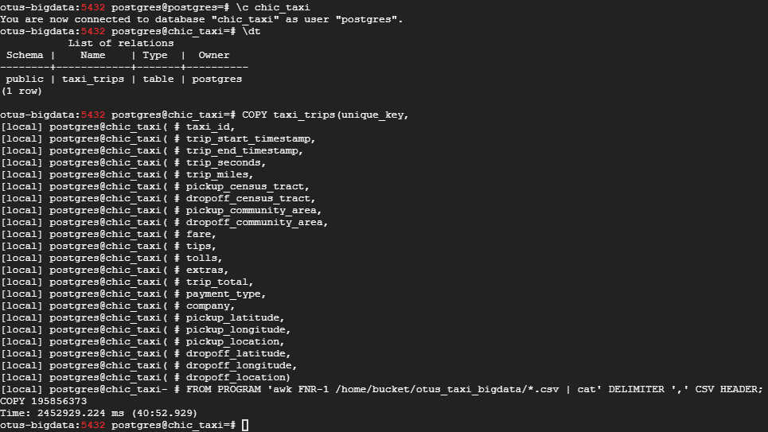

4. Подготовим аналогичный по конфигурации сервер и установим на него <b>MySQL</b>:

`sudo apt update`  

`sudo apt install mysql-server mysql-client`

`sudo mysql_secure_installation`

<i>Пароль <b>root</b> - <b>postgres</b></i>

`create database chic_taxi;`

`use chic_taxi`

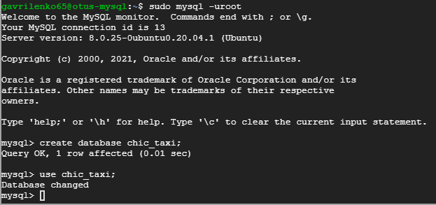

Создаём таблицу:

Загружаем данные таблицы:

`gsutil -m cp -R gs://otus_taxi_bigdata /home/bucket`

Для загрузки данных в БД создадим скрипт (<b>load.sh</b>):

`#!/usr/bin/env bash`  
`cd /home/bucket/otus_taxi_bigdata/`  
`for f in *.csv`  
`do`  
   `mysql -uroot --local-infile chic_taxi -e "LOAD DATA LOCAL INFILE '"$f"'INTO TABLE taxi_trips FIELDS TERMINATED BY ',' IGNORE 1 ROWS;"`  
`done` 

Настроим <b>MySQL</b>:

Т.к. среда тестовая - не забываем отключить бинлоги для экономии места:

`mysql> SET GLOBAL local_infile=1;`

`mysql> SHOW GLOBAL VARIABLES LIKE 'local_infile';  //Проверим`

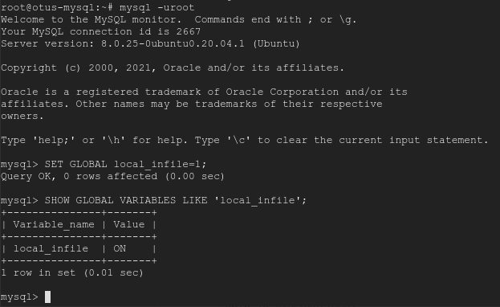

Запускаем скрипт загрузки:

`# ./load.sh`

После завершения загрузки проверим количество записей:

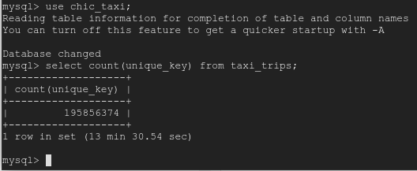

Теперь запустим запрос на БД <b>MySQL</b>:

`mysql> set profiling=1;`

`SELECT payment_type, round(sum(tips)/sum(trip_total)*100, 0) + 0 as tips_percent, count(*) as c`  
`FROM taxi_trips`   
`group by payment_type`  
`order by 3;`

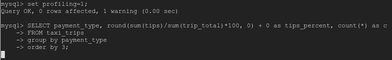

5. Подключимся к <b>PostgreSQL</b> и запустим запрос:

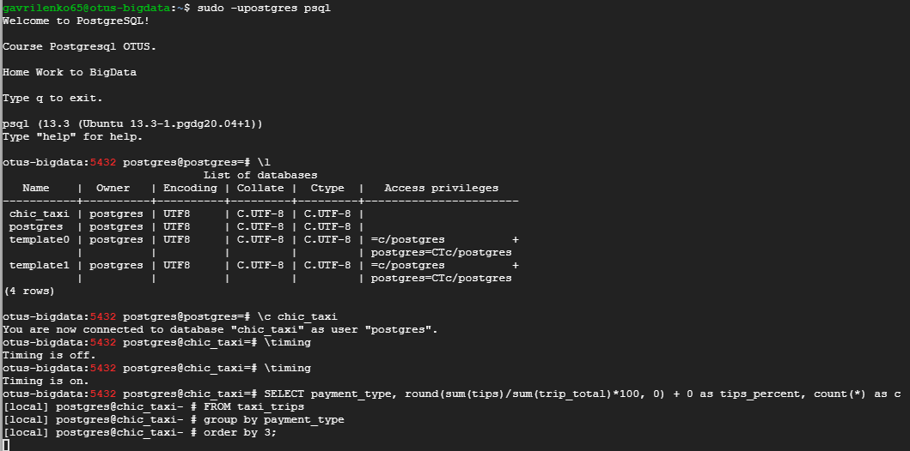

