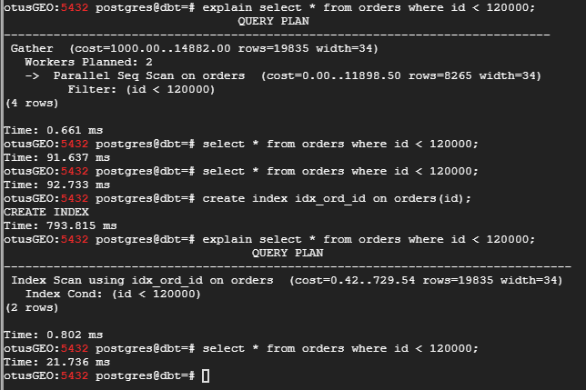
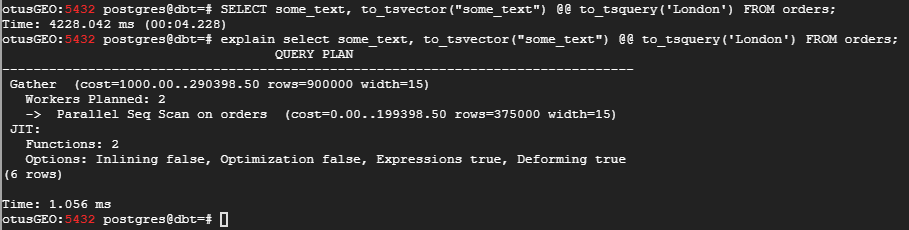
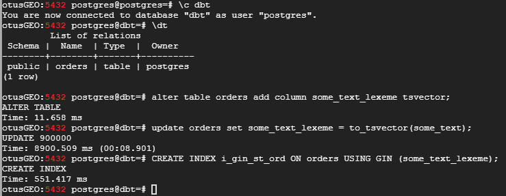
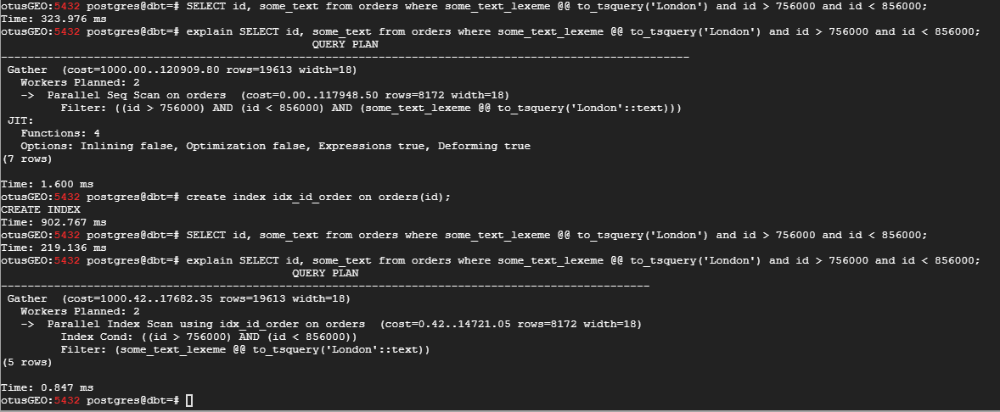

## Домашнее задание № 12 (Сбор и использование статистики)

1. Создадим БД <b>dbt</b> с таблицей <b>orders</b> и заполним её данными:

`insert into orders(id, user_id, order_date, status, some_text)`  
`select generate_series, (random() * 70), date'2019-01-01' + (random() * 300)::int as order_date`  
        `, (array['returned', 'completed', 'placed', 'shipped'])[(random() * 4)::int]`  
        `, concat_ws(' ', (array['go', 'space', 'sun', 'London'])[(random() * 5)::int]`  
            `, (array['the', 'capital', 'of', 'Great', 'Britain'])[(random() * 6)::int]`  
            `, (array['some', 'another', 'example', 'with', 'words'])[(random() * 6)::int]`  
            `)`  
`from generate_series(100001, 1000000);`

Посмотрим план выполнения запроса к этой таблице в отсутствии индекса:

`explain select * from orders where id < 120000;`

Вывод следующий:

> QUERY PLAN                                   
> ---------------------------------------------------------------------------  
> Gather  (cost=1000.00..14882.00 rows=19835 width=34)  
   Workers Planned: 2  
   ->  Parallel Seq Scan on orders  (cost=0.00..11898.50 rows=8265 width=34)    
         Filter: (id < 120000)   
(4 rows)  

Время выполнения запроса:

`otusGEO:5432 postgres@dbt=# select * from orders where id < 120000;`  
`Time: 91.637 ms`

Построим индекс по полю <b>id</b>:

`create index idx_ord_id on orders(id);`

Повторим запрос:

`explain select * from orders where id < 120000;`

> QUERY PLAN                                
> --------------------------------------------------------------------------  
> Index Scan using idx_ord_id on orders  (cost=0.42..729.54 rows=19835 width=34)  
   Index Cond: (id < 120000)  
(2 rows)  

Время выполнения запроса:

`otusGEO:5432 postgres@dbt=# select * from orders where id < 120000;`  
`Time: 21.736 ms`

2. #### Полнотекстовый поиск (FTS)

>Как гласит документация, для полнотекстового поиска требуется использовать типы tsvector и tsquery. 
>Первый хранит текст документа в оптимизированном для поиска виде, второй — хранит полнотекстовый запрос.
>Для поиска в PostgreSQL есть функции to_tsvector, plainto_tsquery, to_tsquery. Для ранжирования результатов есть ts_rank.

Выполним запрос к нашей таблице - найти значения поля <b>some_text</b>, где встречается слово <b>London</b>:

`SELECT some_text, to_tsvector("some_text") @@ to_tsquery('London') FROM orders;`

`otusGEO:5432 postgres@dbt=# SELECT some_text, to_tsvector("some_text") @@ to_tsquery('London') FROM orders;`  
`Time: 4228.042 ms (00:04.228)`   

`otusGEO:5432 postgres@dbt=# explain select some_text, to_tsvector("some_text") @@ to_tsquery('London') FROM orders;`  
                                   `QUERY PLAN`                                    
`---------------------------------------------------------------------------------`  
 `Gather  (cost=1000.00..290398.50 rows=900000 width=15)`  
   `Workers Planned: 2`  
   `->  Parallel Seq Scan on orders  (cost=0.00..199398.50 rows=375000 width=15)`  
 `JIT:`  
   `Functions: 2`  
   `Options: Inlining false, Optimization false, Expressions true, Deforming true`  
`(6 rows)`  

Время выполнения запроса около 4,2 сек. Видим, что запрос сканирует всю таблицу (т.к. нет индекса) и функция <b>to_tsvector</b> вызывается для каждой строки таблицы.

>Для полнотекстового поиска PostgreSQL предлагает два индекса на выбор:  
>
> * GIN — быстро ищет, но не слишком быстро обновляется. Отлично работает, если вы сравнительно редко меняете данные, по которым ищите;
> * GiST — ищет медленнее GIN, зато очень быстро обновляется. Может лучше подходить для поиска по очень часто обновляемым данным;
>Если сомневаетесь, берите GIN. Обычно все используют именно его. GiST же имеет смысл использовать при довольно экзотической нагрузке. Узнать чуть больше о кишочках работы >полнотекстового поиска поверх GIN и GiST можно [здесь](https://www.postgresql.org/docs/9.6/textsearch-indexes.html).

Построим индекс (для этого необходимо модифицировать таблицу, добавив поле с типом <b>tsvector</b>:

`alter table orders add column some_text_lexeme tsvector;`

`update orders set some_text_lexeme = to_tsvector(some_text);`

`CREATE INDEX i_gin_st_ord ON orders USING GIN (some_text_lexeme);`

Повторим запрос, но уже используя индекс <b>GIN</b>:

`SELECT some_text from orders where some_text_lexeme @@ to_tsquery('London');`

Результат:

`otusGEO:5432 postgres@dbt=# SELECT some_text from orders where some_text_lexeme @@ to_tsquery('London');`
`Time: 1666.460 ms (00:01.666)`

Время выполнения запроса уменьшилось в 3,5 раза, т.к. функция <b>to_tsvector</b> не обрабатывает каждую строку.

Выполним поиск с условием по 2-м полям (без индекса):

`SELECT id, some_text from orders where some_text_lexeme @@ to_tsquery('London') and id > 756000 and id < 856000;`

После чего построим индекс <b>idx_id_order</b> по полю <b>id</b> и повторим запрос:

`create index idx_id_order on orders(id);`

Результаты без индекса:

`otusGEO:5432 postgres@dbt=# SELECT id, some_text from orders where some_text_lexeme @@ to_tsquery('London') and id > 756000 and id < 856000;`  
`Time: 323.976 ms`  
`otusGEO:5432 postgres@dbt=# explain SELECT id, some_text from orders where some_text_lexeme @@ to_tsquery('London') and id > 756000 and id < 856000;`  
                                               `QUERY PLAN`                                                 
`--------------------------------------------------------------------------------------------------------`  
 `Gather  (cost=1000.00..120909.80 rows=19613 width=18)`  
   `Workers Planned: 2`  
   `->  Parallel Seq Scan on orders  (cost=0.00..117948.50 rows=8172 width=18)`  
         `Filter: ((id > 756000) AND (id < 856000) AND (some_text_lexeme @@ to_tsquery('London'::text)))`  
 `JIT:`  
   `Functions: 4`  
   `Options: Inlining false, Optimization false, Expressions true, Deforming true`  
`(7 rows)`  
`Time: 1.600 ms`  

Теперь тоже самое, но с использованием индекса:

`otusGEO:5432 postgres@dbt=# SELECT id, some_text from orders where some_text_lexeme @@ to_tsquery('London') and id > 756000 and id < 856000;`  
`Time: 219.136 ms`  
`otusGEO:5432 postgres@dbt=# explain SELECT id, some_text from orders where some_text_lexeme @@ to_tsquery('London') and id > 756000 and id < 856000;`  
                                            `QUERY PLAN`                                              
`--------------------------------------------------------------------------------------------------`  
 `Gather  (cost=1000.42..17682.35 rows=19613 width=18)`  
   `Workers Planned: 2`  
   `->  Parallel Index Scan using idx_id_order on orders  (cost=0.42..14721.05 rows=8172 width=18)`  
         `Index Cond: ((id > 756000) AND (id < 856000))`  
         `Filter: (some_text_lexeme @@ to_tsquery('London'::text))`  
`(5 rows)`  
`Time: 0.847 ms`  

Разница почти в 1,8 раза.

#### Составной индекс

Сделаем следующий запрос к таблице:

`select order_date, status from orders where order_date between date'2019-01-01' and date'2019-06-01';`

Смотрим время выполнения запроса и <b>explain</b>:

`Time: 284.946 ms`
`otusGEO:5432 postgres@dbt=# explain select order_date, status from orders where order_date between date'2019-01-01' and date'2019-06-01';`
                                      `QUERY PLAN`                                       
`---------------------------------------------------------------------------------------`
 `Seq Scan on orders  (cost=0.00..31136.00 rows=455740 width=12)`
   `Filter: ((order_date >= '2019-01-01'::date) AND (order_date <= '2019-06-01'::date))`
`(2 rows)`
`Time: 0.537 ms`

Построим составной индекс и повторим запрос:

`create index idx_ord_order_date_status on orders(order_date, status);`

Интересно, что запрос с использованием индекса выполнялся по времени, почти столько же (наблюдается незначительный прирост):

`otusGEO:5432 postgres@dbt=# create index idx_ord_order_date_status on orders(order_date, status);`
`CREATE INDEX`
`Time: 1267.204 ms (00:01.267)`
`otusGEO:5432 postgres@dbt=# select order_date, status from orders where order_date between date'2019-01-01' and date'2019-06-01';`
`Time: 217.426 ms`
`otusGEO:5432 postgres@dbt=# explain select order_date, status from orders where order_date between date'2019-01-01' and date'2019-06-01';`
                                              `QUERY PLAN`                                               
`-------------------------------------------------------------------------------------------------------`
 `Index Only Scan using idx_ord_order_date_status on orders  (cost=0.42..10757.02 rows=455830 width=12)`
   `Index Cond: ((order_date >= '2019-01-01'::date) AND (order_date <= '2019-06-01'::date))`
`(2 rows)`

Связано это с большим объёмом выводимых данных (фулскан почти не устапает выбору по индексу). А если сузить диапазон поиска, то разница в скорости очевидна (в 3,5 раза):

`otusGEO:5432 postgres@dbt=# drop index if exists idx_ord_order_date_status;`
`DROP INDEX`
`Time: 3.479 ms`
`otusGEO:5432 postgres@dbt=# select order_date, status from orders where order_date between date'2019-01-01' and date'2019-02-01';`
`Time: 141.748 ms`
`otusGEO:5432 postgres@dbt=# explain select order_date, status from orders where order_date between date'2019-01-01' and date'2019-02-01';`
                                      `QUERY PLAN`                                       
`---------------------------------------------------------------------------------------`
 `Seq Scan on orders  (cost=0.00..31136.00 rows=92815 width=12)`
   `Filter: ((order_date >= '2019-01-01'::date) AND (order_date <= '2019-02-01'::date))`
`(2 rows)`
`Time: 0.561 ms`
`otusGEO:5432 postgres@dbt=# create index idx_ord_order_date_status on orders(order_date, status);`
`CREATE INDEX`
`Time: 1234.181 ms (00:01.234)`
`otusGEO:5432 postgres@dbt=# select order_date, status from orders where order_date between date'2019-01-01' and date'2019-02-01';`
`Time: 43.825 ms`
`otusGEO:5432 postgres@dbt=# explain select order_date, status from orders where order_date between date'2019-01-01' and date'2019-02-01';`
                                             `QUERY PLAN`                                              
`-----------------------------------------------------------------------------------------------------`
 `Index Only Scan using idx_ord_order_date_status on orders  (cost=0.42..2194.51 rows=92904 width=12)`
   `Index Cond: ((order_date >= '2019-01-01'::date) AND (order_date <= '2019-02-01'::date))`
`(2 rows)`

3. Подготовим [тренировочную БД](https://postgrespro.com/docs/postgrespro/13/demodb-bookings-installation):
  - скачиваем  
  `wget https://edu.postgrespro.com/demo-medium-en.zip`
  
  - создаём ДБ <b>demo</b>

  
  
  - разворачиваем  (немного отредактируем файл дампа и запустим на выполнение)   
  
  
  
  `psql --set ON_ERROR_STOP=on demo < /home/dump/demo-medium-en-20170815.sql`
  
  

#### Ссылки:  
https://postgrespro.com/education/demodb - демо БД  
https://eax.me/postgresql-full-text-search/ - основы FTS
https://habr.com/ru/post/442170/ - хабр FTS
https://www.postgresql.org/docs/9.6/textsearch-indexes.html = GIN и GiST
