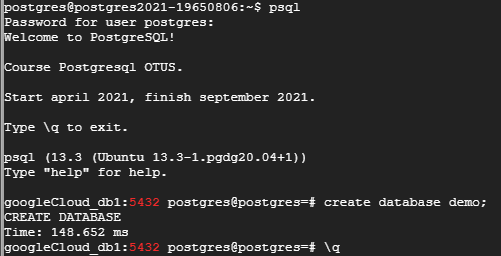
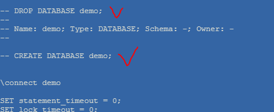
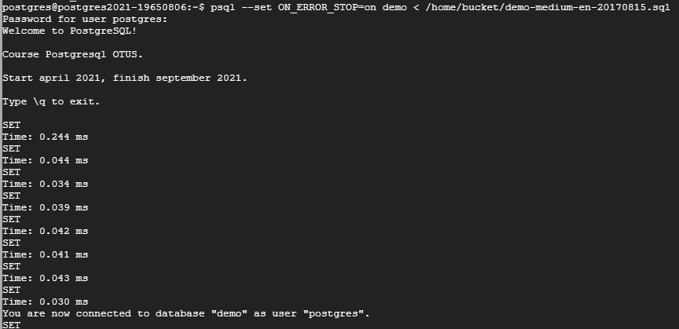

## Домашнее задание № 12 (Сбор и использование статистики)

1. Создадим БД <b>dbt</b> с таблицей <b>orders</b> и заполним её данными:

`insert into orders(id, user_id, order_date, status, some_text)`  
`select generate_series, (random() * 70), date'2019-01-01' + (random() * 300)::int as order_date`  
        `, (array['returned', 'completed', 'placed', 'shipped'])[(random() * 4)::int]`  
        `, concat_ws(' ', (array['go', 'space', 'sun', 'London'])[(random() * 5)::int]`  
            `, (array['the', 'capital', 'of', 'Great', 'Britain'])[(random() * 6)::int]`  
            `, (array['some', 'another', 'example', 'with', 'words'])[(random() * 6)::int]`  
            `)`  
`from generate_series(100001, 1000000);`

Посмотрим план выполнения запроса к этой таблице в отсутствии индекса:

`explain select * from orders where id < 100;`

Вывод следующий:

> QUERY PLAN                                   
---------------------------------------------------------------------------  
> Gather  (cost=1000.00..12907.50 rows=90 width=34)  
   Workers Planned: 2  
   ->  Parallel Seq Scan on orders  (cost=0.00..11898.50 rows=38 width=34)  
         Filter: (id < 100)  
(4 rows)  

2. Подготовим [тренировочную БД](https://postgrespro.com/docs/postgrespro/13/demodb-bookings-installation):
  - скачиваем  
  `wget https://edu.postgrespro.com/demo-medium-en.zip`
  
  - создаём ДБ <b>demo</b>

  
  
  - разворачиваем  (немного отредактируем файл дампа и запустим на выполнение)   
  
  
  
  `psql --set ON_ERROR_STOP=on demo < /home/dump/demo-medium-en-20170815.sql`
  
  

#### Ссылки:  
https://postgrespro.com/education/demodb - демо БД  
