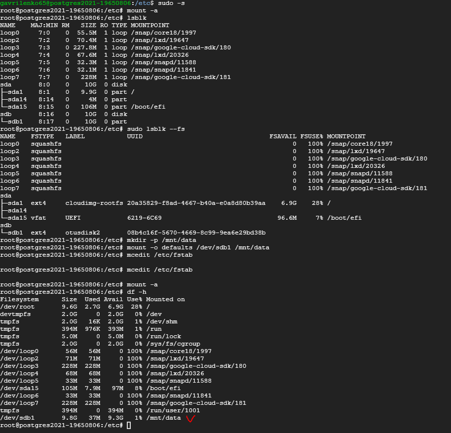

### Домашнее задание № 3 (Физический уровень PostgreSQL)

1. Создаём новый ssd диск на 10 Гб. и добавляем (attach) к нашей VM.

2. Для лёгкого и простого монтирования диска к виртуальной машине, устанавливает необходимый инструмент:  
	`sudo apt-get update`  
	`sudo apt-get install parted`  

3. Командой sudo parted -l | grep Error находим неопознаный диск в системе. В нашем случае это будет sdb:  
	`Error: /dev/sdb: unrecognised disk label`

4. Теперь необходимо новый диск отформатировать и примонтировать его к нашей системе:  
	`sudo parted /dev/sdb mklabel gpt   //выбрали стандарт разметки`  
	`sudo parted -a opt /dev/sdb mkpart primary ext4 0% 100%  //создаём новую партицию (sdb1) на новом диске`  
	`sudo mkfs.ext4 -L datapartition /dev/sdb1 //форматируем созданную партицию в ФС ext4`  
	`sudo e2label /dev/sdb1 otusdisk2  //присваиваем метку (label) нашему новому диску`  

5. Монтируем новую партицию в <b>/mnt/data</b>, вносим изменения в <b>/etc/fstab</b> (<i>LABEL=otusdisk2 /mnt/data ext4 defaults 0 2</i>) и делаем владельцем пользователя postgres:  
	

6. Останавливаем службу postgresql и переносим (<b>mv</b>) директорию с данными (<i>/var/lib/postgresql/12/main</i>) на новый диск (в <i>/mnt/data/</i>):  
	2_stop_DB.PNG
	
Теперь служба (кластер) postgresql не сможет стартовать - там где она ищет файлы данных (параметр <b>data_directory</b> в файле <i>/etc/postgresql/12/main/postgresql.conf</i>) - пусто.

7. Редактируем файл параметров - указываем новый путь, где находятся файлы БД:
	3_change_path_datafiles.PNG

8. После внесения изменений служба стартовала без ошибок. БД готова к использованию:
	4_start_DB.PNG
	
9. Теперь создадим новую БД first_instance. В ней создадим таблицу test_dz и вставим строку с текстом:
	first_instance=# insert into test_dz(text_data) values('This text was write on postgres2021-19650806 instance');
	6_create_DB_ins1.PNG 

Теперь мы имеем ВМ с новым диском и не стандартным расположением файлов данных (/mnt/data/main).
Следующим шагом создадим новую ВМ (аналогично существующей), отмонтируем диск с файлами данных от первой машины и примонтируем к новой.

10. Создаём новую ВМ - instance-dz3. Устанавливаем postgresql и проверяем:
	7_create_new_VM.PNG
	7_1_install_PG_new_VM.PNG
	
11. Через консоль GCP отмонтируем наш диск от VM postgres2021-19650806:
	$ gcloud compute instances detach-disk postgres2021-19650806 --disk=disk-2
	8_detach_disk_VM1.PNG
	
12. И примонтируем его к VM instance-dz3:
	$ gcloud compute instances attach-disk instance-dz3 --disk=disk-2
	9_atachch_disk_VM2.PNG

13. Создаём точку монтирования, монтируем приатаченный диск с даннымиБ делаем владельцем пользователя postgres и правим /etc/fstab:
	sudo mkdir -p /mnt/data
	sudo mount -o defaults /dev/sdb1 /mnt/data
	sudo mcedit /etc/fstab
	LABEL=otusdisk2 /mnt/data ext4 defaults 0 2
	91_mount_disk_VM2.PNG
	
14. Теперь останавливаем кластер, вносим изменения в конфигурационный файл (параметр data_directory) аналогично п.7 и запускаем с новыми параметрами:
	92_change_data_directory_VM2.PNG
	
15. Подключаемся к БД first_instance, созданую на первой ВМ (см. п.9) и вносим в таблицу test_dz новую запись:
	first_instance=# insert into test_dz(text_data) values('This text was write on instance-dz3 instance');
	93_insert_row_VM2.PNG
