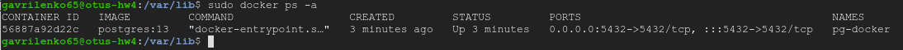

### Домашнее задание № 4 (Установка PostgreSQL)

1. Устанавливаем Docker Engine:

2. Создаём каталог для файлов нашей БД (из контейнера), также создаём docker сеть (<b>pg-net</b>):  
	
	`sudo mkdir /var/lib/postgres`  
	`sudo docker network create pg-net`  

3. Стартуем наш контейнер (с именем <b>pg-docker</b>) и подключаем к нему созданную docker-сеть: 
	
	`sudo  docker run --name pg-docker --network pg-net -e POSTGRES_PASSWORD=postgres -d -p 5432:5432 -v /var/lib/postgres:/var/lib/postgresql/data postgres:13`
    
4. Теперь стартуем контейнер с клиентом postgres и проверяем статус нашего контейнера с БД:  
	
	`sudo docker run -it --rm --network pg-net --name pg-client postgres:13 psql -h 10.128.0.4 -U postgres`  
	`sudo docker ps -a`  
	

5. Соединяемся с кластером, создаём в нём новую БД, в ней таблицу и всавляем 2 строки:
   
   `create database docker_otus;`  
   `\c docker_otus;`  
   `create table t_docker(id integer, name varchar(50);`
   

6. Теперь, для подключение с удалённой машины, нам необходимо добавить порт 5432 в правила firewall нашей VM в GCP. В консоли вводим:
   
   `gcloud compute firewall-rules create otus-docker --allow tcp:5432 --source-ranges=0.0.0.0/0 --description="psql docker"`

 

7. Подключаемся с удалённой машины к нашей БД, проверяем таблицу и вставляем ещё одну строку:

8. Теперь убедимся, что запись появилась, зайдя с клиента в контейнере на локальной машине:

9. Останавливаем и удаляем наш контейнер:
   
   `sudo docker stop pg-docker`  
   `sudo docker rm pg-docker`
  
  убеждаемся, что каталог <b>/var/lib/docker/containers</b> пустой:
  

10. Снова создаём наш контейнер с именем <b>pg-docker</b> и параметрами как в п.3 и видим, что в папке <b>/var/lib/docker/containers</b> появился каталог с нашим
    контейнером:

11. Из контейнера с клиентом подключаемся к нашему кластеру и видим, что все данные остались на месте:

	
	
