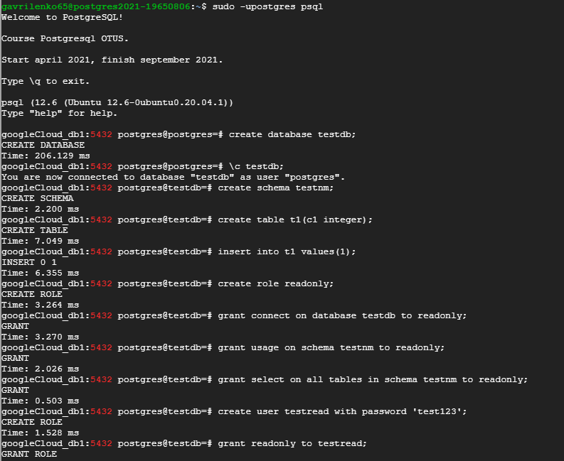
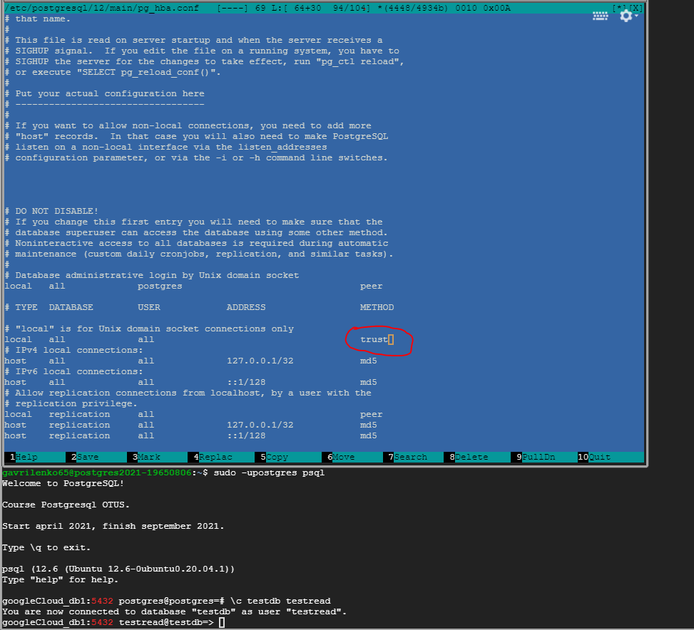
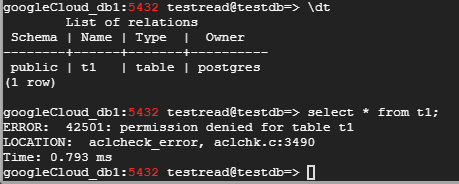
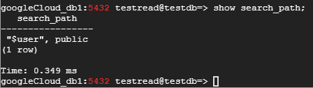
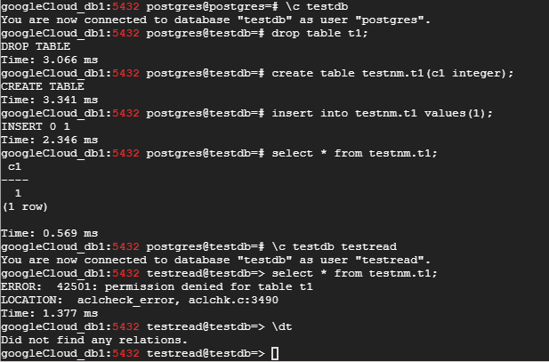
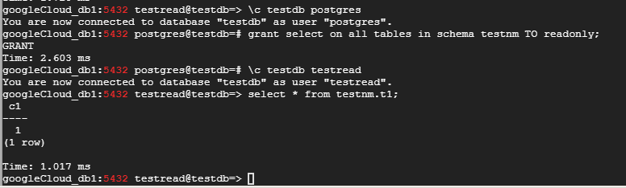
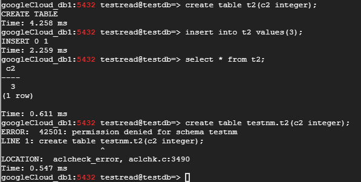
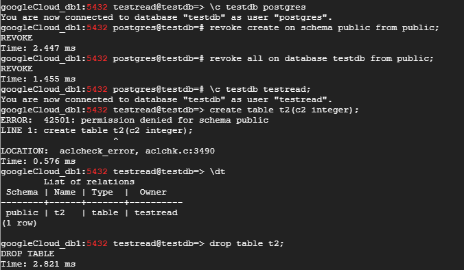
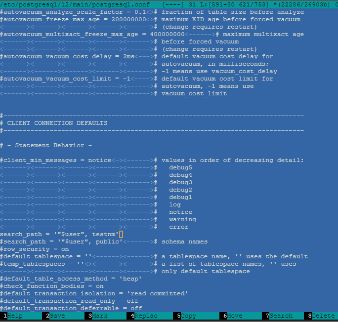
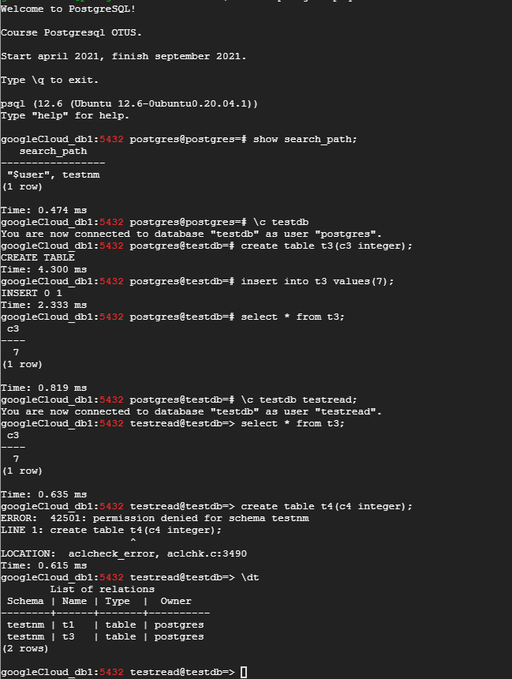

### Домашнее задание № 5(Логический уровень PostgreSQL)

1. Подсоединяемся под пользователем <b>postgres</b> к нашему кластеру, создаём БД <b>testdb</b>:  
	`creare database testdb;`  
	Подключаемся к этой БД и создаём схему <b>testnm</b>:  
	`create schema testnm;`  
	Далее создаём таблицу (<b>без указания схемы!</b>) <b>t1</b> и вставляем в неё данные:  
	`create table t1(c1 integer);`  
	`insert into t1 values(1);`  
	После этого создадим роль на соединение к нашей БД, использования схемы и чтение всех таблиц в схеме:  
	`create role readonly;`  
    `grant connect on database testdb to readonly;`  
    `grant usage on schema testnm to readonly;`  
    `grant select on all tables in schema testnm to readonly;`  
	Создадим пользователя <b>testread</b> и присвоим ему роль <b>readonly</b>:  
	`create user testread with password 'test123';`  
    `grant readonly to testread;`
	
    
	
2. Поправим файл <b>pg_hba.conf</b>, разрешив подключение к нашему кластеру:

    
	
3. Посмотрим какие таблицы есть в БД <b>testdb</b>:  
    `\dt`  
    Видим нашу созданную на шаге 1 таблицу (<b>t1</b>) в схеме <b>public</b>.  
	Пробуем обратиться к ней и получаем ошибку (<b>permission denied for table t1</b>):  
	
	
	
	<b><i>Причина:</i></b> параметр <b>search_path</b> настроен по умолчанию (<b>"$user", public</b>). Этот параметр отвечает за порядок поиска объектов в схемах к которым
	обращается пользователь - сначала идут обязательные системные <b>pg_catalog</b>, <b>временные таблицы</b>. После этого объект ищется в схеме
	с именем пользователя (<i>CURRENT_USER</i>), в нашем случае это должна быть схема <b>postgres</b>. Если схемы пользователя не существует, то
	объект создаётся/ищется в схеме <b>PUBLIC</b>. Мы пользователю <b>testread</b> предоставили право доступа к БД <b>testdb</b> со схемой <b>testnm</b>,
	но не предоставляли доступ к схеме <b>public</b>.

	
	
4. Зайдём под postgres, удалим таблицу <b>t1</b> и пересоздадим с явным указанием имени схемы, вставив строку:  
	`drop table t1;`  
    `create table testnm.t1(c1 integer);`  
    `insert into testnm.t1 values(1);`  

	Опять зайдём под пользователем <b>testread</b> и попробуем обратиться к вновь созданной таблице <b>t1</b>.  
	И опять получаем ошибку. Кроме того, если дать команду <b><i>/dt</i></b>, то мы <b>вообще не увидим никаких объектов в БД testdb</b>.  
	
	
	
	<b><i>Причина:</i></b> давая привилегию <i>grant select on all tables in schema testnm to readonly;</i>, мы давали её на существующие объекты в схеме, а на тот момент <b>t1</b>
	не существовала в схеме <b>testnm</b>. Для того чтобы привилегия заработала, необходимо зайти под пользователем <b>postgres</b> и повторно дать привилегию:  
	`grant select on all tables in schema testnm TO readonly;`
	
	После этого доступ к <b>t1</b> появился:
	
	
	
	Изменим роль <b>readonly</b> так, чтобы она действовала на все создаваемые таблицы:  
	`alter default privileges in schema testnm grant select on tables to readonly;`  
	
5. Теперь, если мы (<b>БЕЗ УКАЗАНИЯ СХЕМЫ</b>) попробуем под пользователем <b>testread</b> создать таблицу, то она создастся в "умолчательной" схеме
   <b>public</b> - на эту схему всем пользователям выдаётся роль <b>public</b>. А вот с <b>УКАЗАНИЕМ СХЕМЫ</b> такой фокус не пройдёт - работает наша роль
   с разрешением только чтения таблиц!
   
   
   
6. Для решения проблемы (использования роли <b>public</b>), можно отобрать права на создание объектов:  
   `\c testdb postgres;`  
   `revoke create on schema public from public;`  
   `revoke all on database testdb from public;`  
   Теперь мы не сможем создавать объекты в схеме по умолчанию. Но удалить ранее созданную таблицу сможем:
   
     
   
7. Второй вариант - изминить глобально переменную <b><i>search_path</i></b>, внеся изменения в файл <b>postgresql.conf</b>:  
   
   
   
   Теперь по умолчанию все объекты будут создаваться пользователем <b>postgres</b> в схеме <b>testnm</b> на которую распространяется наша роль,
   а поьзователь <b>testread</b> может только читать:
   
   
