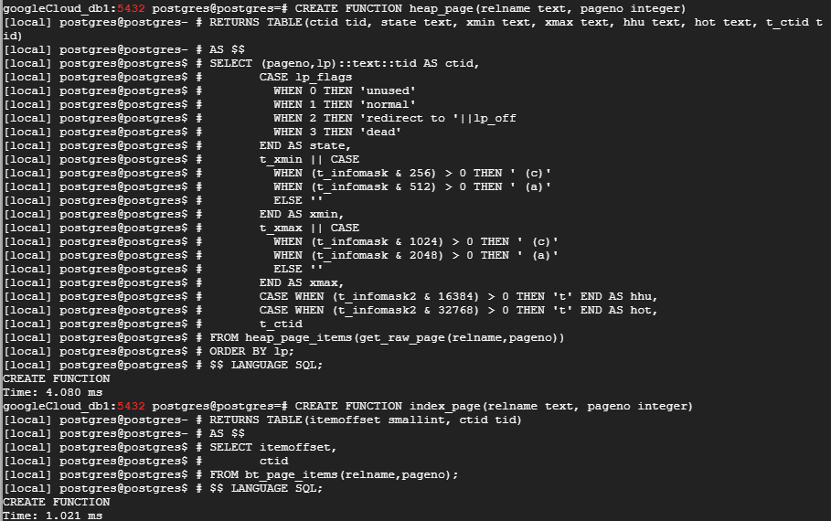
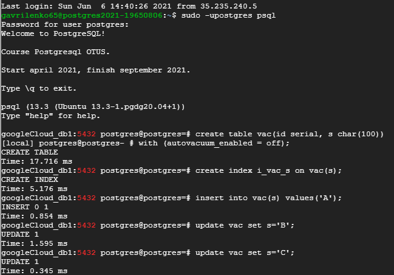
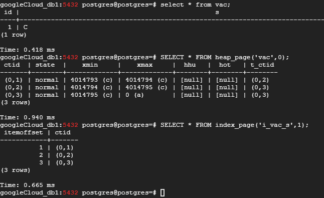
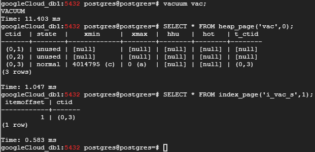
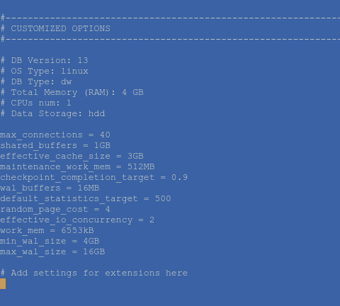
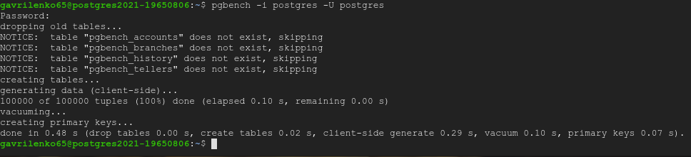
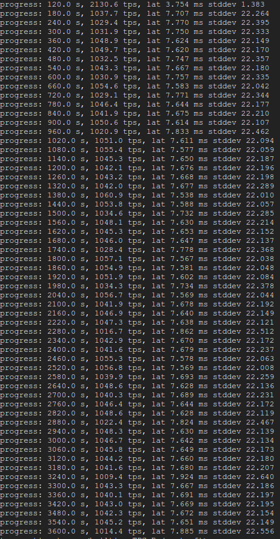

## Домашнее задание № 6 (MVCC, vacuum и autovacuum)

1. <b>VACUUM</b>
 >очистка обрабатывает таблицу полностью. Она вычищает не только ненужные версии строк, но и ссылки на них из всех индексов.
Обработка происходит параллельно с другой активностью в системе. Таблица и индексы при этом могут использоваться обычным образом и для чтения, и для изменения (однако одновременное выполнение таких команд, как CREATE INDEX, ALTER TABLE и некоторых других будет невозможно).  
В таблице просматриваются только те страницы, в которых происходила какая-то активность. Для этого используется карта видимости (напомню, что в ней отмечены страницы, содержащие только достаточно старые версии строк, которые гарантированно видимы во всех снимках данных). Обрабатываются только страницы, не отмеченные в карте, а сама карта при этом обновляется.

Посмотрим это на практике:

* Подготовка:

`CREATE EXTENSION pageinspect;`

Создадим функцию для наблюдения за табличными страницами:

 `CREATE FUNCTION heap_page(relname text, pageno integer)`  
`RETURNS TABLE(ctid tid, state text, xmin text, xmax text, hhu text, hot text, t_ctid tid)`  
`AS $$`  
`SELECT (pageno,lp)::text::tid AS ctid,`  
       `CASE lp_flags`  
        `WHEN 0 THEN 'unused'`  
         `WHEN 1 THEN 'normal'`  
         `WHEN 2 THEN 'redirect to '||lp_off`  
         `WHEN 3 THEN 'dead'`  
       `END AS state,`  
       `t_xmin || CASE`  
         `WHEN (t_infomask & 256) > 0 THEN ' (c)'`  
         `WHEN (t_infomask & 512) > 0 THEN ' (a)'`  
         `ELSE ''`  
       `END AS xmin,`  
       `t_xmax || CASE`  
         `WHEN (t_infomask & 1024) > 0 THEN ' (c)'`  
         `WHEN (t_infomask & 2048) > 0 THEN ' (a)'`  
         `ELSE ''`  
       `END AS xmax,`  
       `CASE WHEN (t_infomask2 & 16384) > 0 THEN 't' END AS hhu,`  
       `CASE WHEN (t_infomask2 & 32768) > 0 THEN 't' END AS hot,`  
       `t_ctid`  
`FROM heap_page_items(get_raw_page(relname,pageno))`  
`ORDER BY lp;`  
`$$ LANGUAGE SQL;`

Также создадим функцию за наблюдением за индексными страницами:

`CREATE FUNCTION index_page(relname text, pageno integer)`  
`RETURNS TABLE(itemoffset smallint, ctid tid)`  
`AS $$`  
`SELECT itemoffset,`  
       `ctid`  
`FROM bt_page_items(relname,pageno);`  
`$$ LANGUAGE SQL;`

 

* Создаём таблицу с отключённым <b><i>autovacuum</i></b>, создаём индекс, вставляем строку и дважды обновляем её:

 `CREATE TABLE vac(`  
  `id serial,`  
  `s char(100)`  
`) WITH (autovacuum_enabled = off);`

`CREATE INDEX vac_s ON vac(s);`  
`INSERT INTO vac(s) VALUES ('A');`  
`UPDATE vac SET s = 'B';`  
`UPDATE vac SET s = 'C';` 

 
 
* Обратимся к страницам таблицы и индекса. Видим 3 версии строки (в таблице) и три версии ссылок (в индексе):

 `SELECT * FROM heap_page('vac',0);`  
 `SELECT * FROM index_page('i_vac_s',1);`  
 
  
  
* Теперь запустим <b>vacuum</b> на нашу таблицу. В результате мы должны увидеть только актуальную строку в таблице и только актуальную ссылку в индексе:

 `VACUUM vac;`  
 `SELECT * FROM heap_page('vac',0);`  
 `SELECT * FROM index_page('i_vac_s',1);`  
 
 

2. Применим параметры к кластеру, указанные в задании:

 
 
3. Создаём объекты <b>pgbench</b> для тестирования:
 
 `pgbench -i postgres -U postgres`
 
 
 
4. Прогон теста (без настроек Vacuum):

 `pgbench -c8 -P 60 -T 3600 -U postgres postgres`
 
 

### Ссылки:

https://habr.com/ru/company/postgrespro/blog/449704/  
https://habr.com/ru/company/postgrespro/blog/452320/
