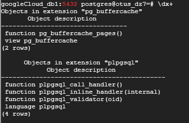
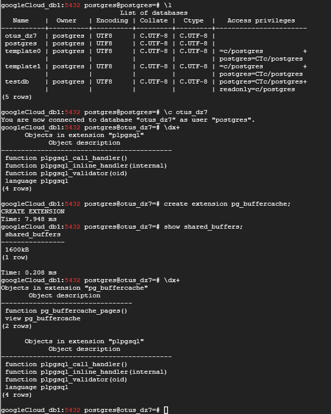
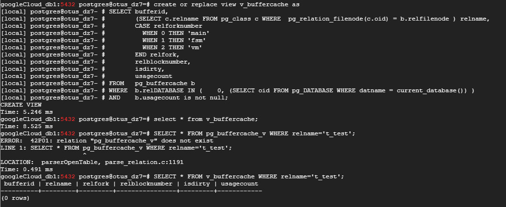
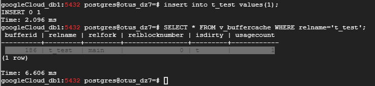
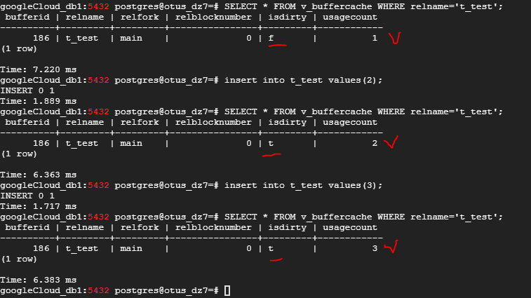
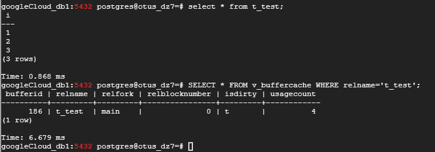
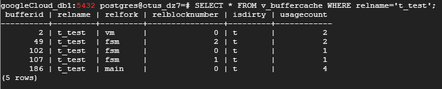
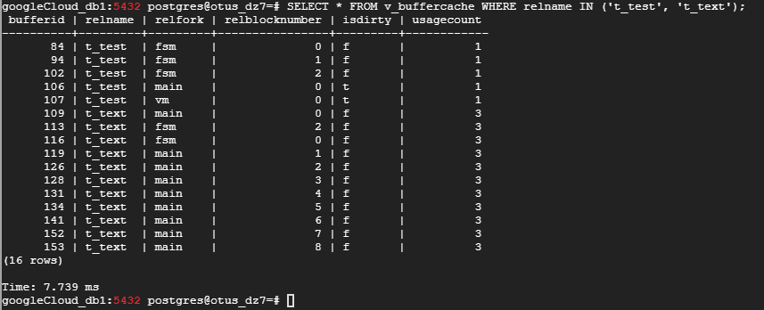
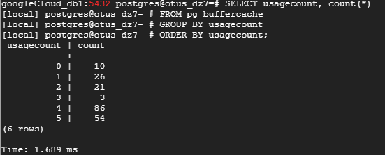
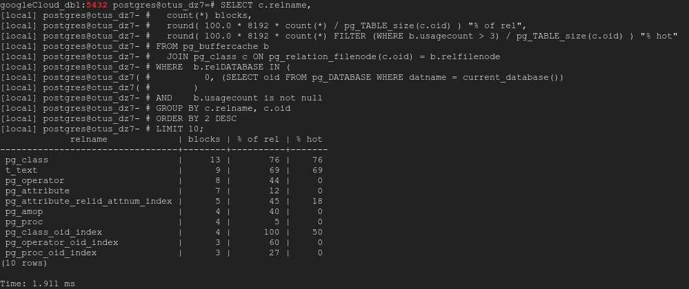

### Домашнее задание № 7 (Журналы PostgreSQL)

1. Подготовим наш кластер к экспериментам: установим количество буферов 200 (для удобства наблюдения),
   создадим БД (<b>otus_dz7</b>) и установим расширение <b>pg_buffercache</b> (устанавливается только на текущую БД):

	`show shared_buffers;`  
	`1600 kb` // 1600/8 = 200 (200 буферов по 8 kb каждый)    
	`create database otus_dz7;`  
	`\c otus_dz7;`  
	`create extension pg_buffercache;`  
	`\dx+` 

	   

	

2. Создадим таблицу (<b>t_test</b>) в нашей БД и создадим представление (<b>v_buffercache</b>) для наблюдения за буферным кэшем:  

	`create table t_test(i int);`  

	`create or replace view v_buffercache as`  
	`SELECT bufferid,`  
		`(SELECT c.relname FROM pg_class c WHERE  pg_relation_filenode(c.oid) = b.relfilenode ) relname,`  
		`CASE relforknumber`  
			`WHEN 0 THEN 'main'`  
			`WHEN 1 THEN 'fsm'`  
			`WHEN 2 THEN 'vm'`  
		`END relfork,`  
		`relblocknumber,`  
		`isdirty,`  
		`usagecount`  
	`FROM   pg_buffercache b`  
	`WHERE  b.relDATABASE IN (0, (SELECT oid FROM pg_DATABASE WHERE datname = current_database()) )`  
	`AND    b.usagecount is not null;`  

   Убедимся, что в буферном кэше нет никаких объектов, относящейся к нашей пустой таблице t_test:
  
	`select * from v_buffercache WHERE relname='t_test';`  

	

3. Вставим одну строку в нашу таблицу. Что должно произойти? В буферном кэше должен появится "грязный" (требует записи на диск) буфер с счётчиком обращений
   (<b>usage count</b>) равным 1:

	`insert into t_test values(1);`  
	`SELECT * FROM v_buffercache WHERE relname='t_test';`

	

4. Вставим в таблицу (<b>t_test</b>) ещё 2 строки. Видим, что значения буфера (bufferid 186) меняются: сначала, по прошествии некоторого времени после вставки первой строки, мы
 видим, что изменения были записаны на диск и буфер перестал быть "грязным" (<b>isdirty f</b>). После очередной вставки буфер опять выставляет значение <b>isdirty</b> в  значение <b>t(rue)</b> и увеличивает счётчик обращений (<b>usage count</b>) на 1:

	`insert into t_test values(2);`  
	`insert into t_test values(3);`  

	
	
   Ещё стоит обратить внимание, что при обращении к нашей таблице счётчик обращений (<b>usage count</b>) также увеличивается:

	`select * from t_test;`

	

5. Выполним очистку и посмотрим что изменится в буферном кэше:

	`VACUUM t_test;`

   Очистка создала карту видимости (одна страница) и карту свободного пространства (три страницы — минимальный размер этой карты):

	 
	
   Карта видимости (<i>Visibility Map</i>, <b>VM</b>) хранит страницы видимые ВСЕМ активным транзакциям (т.е. на странице нет кортежей для очистки), а также в этой
карте хранятся страницы со всеми замороженными кортежами.  
	```diff
	- Про карту свободного пространства не совсем понял. Написано (на хабре), что создаётся 3 (три) файла .fsm.  
	Цитата: 
	> Очистка создала карту видимости (одна страница) и карту свободного пространства (три страницы — минимальный размер этой карты). 
	Почему 3 (три) страницы?

6. Создадим ещё одну таблицу (<b>t_text</b>) с текстовым полем и заполним её данными:

	`create table t_text(t text);`

	`insert into t_text SELECT 'Тексовая строка '||s.id FROM generate_series(1,1000) AS s(id);`

   Вставим новую строку в таблицу <b>t_test</b>:

	`insert into t_test values(5);`

   Теперь посмотрим в буфер:

	`SELECT * FROM v_buffercache WHERE relname IN ('t_test', 't_text');`

	

7. Посмотрим распределение буферов по частоте их использования (<b>usage count</b>):

	`SELECT usagecount, count(*)`  
	`FROM pg_buffercache`  
	`GROUP BY usagecount`  
	`ORDER BY usagecount;`

	

  Использование кэша (в %) при счётчике использования более 3 - т.е. наиболее часто испозьзуемые таблицы в БД.

	`SELECT c.relname,`  
	  `count(*) blocks,`  
  	`round( 100.0 * 8192 * count(*) / pg_TABLE_size(c.oid) ) "% of rel",`  
  	`round( 100.0 * 8192 * count(*) FILTER (WHERE b.usagecount > 3) / pg_TABLE_size(c.oid) ) "% hot"`  
	`FROM pg_buffercache b`  
  	`JOIN pg_class c ON pg_relation_filenode(c.oid) = b.relfilenode`  
	`WHERE  b.relDATABASE IN (`  
        	 `0, (SELECT oid FROM pg_DATABASE WHERE datname = current_database())`  
       	`)`  
	`AND    b.usagecount is not null`  
	`GROUP BY c.relname, c.oid`  
	`ORDER BY 2 DESC`  
	`LIMIT 10;`  
	
     
	
	
8. <b>WAL</b> <i>(write-ahead logging)</i> - журнал предзаписи:

	* изменение страниц в буферном кеше (как правило, это страницы таблиц и индексов) — так как измененная страница попадает на диск не сразу;
	* фиксация и отмена транзакций — изменение статуса происходит в буферах XACT и тоже попадает на диск не сразу;
	* файловые операции (создание и удаление файлов и каталогов, например, создание файлов при создании таблицы) — так как эти операции должны происходить синхронно с изменением данных.

 В журнал не записываются:  

       * операции с нежурналируемыми (unlogged) таблицами — их название говорит само за себя;  
       * операции с временными таблицами — нет смысла, поскольку время жизни таких таблиц не превышает времени жизни создавшего их сеанса.  
	
