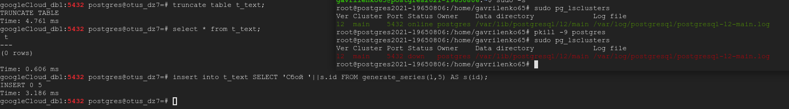

### Домашнее задание № 7 (Журналы PostgreSQL)

1. Подготовим наш кластер к экспериментам: установим количество буферов 200 (для удобства наблюдения),
   создадим БД (<b>otus_dz7</b>) и установим расширение <b>pg_buffercache</b> (устанавливается только на текущую БД):

	`show shared_buffers;`  
	`1600 kb` // 1600/8 = 200 (200 буферов по 8 kb каждый)    
	`create database otus_dz7;`  
	`\c otus_dz7;`  
	`create extension pg_buffercache;`  
	`\dx+` 

	   

	

2. Создадим таблицу (<b>t_test</b>) в нашей БД и создадим представление (<b>v_buffercache</b>) для наблюдения за буферным кэшем:  

	`create table t_test(i int);`  

	`create or replace view v_buffercache as`  
	`SELECT bufferid,`  
		`(SELECT c.relname FROM pg_class c WHERE  pg_relation_filenode(c.oid) = b.relfilenode ) relname,`  
		`CASE relforknumber`  
			`WHEN 0 THEN 'main'`  
			`WHEN 1 THEN 'fsm'`  
			`WHEN 2 THEN 'vm'`  
		`END relfork,`  
		`relblocknumber,`  
		`isdirty,`  
		`usagecount`  
	`FROM   pg_buffercache b`  
	`WHERE  b.relDATABASE IN (0, (SELECT oid FROM pg_DATABASE WHERE datname = current_database()) )`  
	`AND    b.usagecount is not null;`  

   Убедимся, что в буферном кэше нет никаких объектов, относящейся к нашей пустой таблице t_test:
  
	`select * from v_buffercache WHERE relname='t_test';`  

	

3. Вставим одну строку в нашу таблицу. Что должно произойти? В буферном кэше должен появится "грязный" (требует записи на диск) буфер с счётчиком обращений
   (<b>usage count</b>) равным 1:

	`insert into t_test values(1);`  
	`SELECT * FROM v_buffercache WHERE relname='t_test';`

	

4. Вставим в таблицу (<b>t_test</b>) ещё 2 строки. Видим, что значения буфера (bufferid 186) меняются: сначала, по прошествии некоторого времени после вставки первой строки, мы
 видим, что изменения были записаны на диск и буфер перестал быть "грязным" (<b>isdirty f</b>). После очередной вставки буфер опять выставляет значение <b>isdirty</b> в  значение <b>t(rue)</b> и увеличивает счётчик обращений (<b>usage count</b>) на 1:

	`insert into t_test values(2);`  
	`insert into t_test values(3);`  

	
	
   Ещё стоит обратить внимание, что при обращении к нашей таблице счётчик обращений (<b>usage count</b>) также увеличивается:

	`select * from t_test;`

	

5. Выполним очистку и посмотрим что изменится в буферном кэше:

	`VACUUM t_test;`

   Очистка создала карту видимости (одна страница) и карту свободного пространства (три страницы — минимальный размер этой карты):

	 
	
   Карта видимости (<i>Visibility Map</i>, <b>VM</b>) хранит страницы видимые ВСЕМ активным транзакциям (т.е. на странице нет кортежей для очистки), а также в этой
карте хранятся страницы со всеми замороженными кортежами.  
	```diff
	- Про карту свободного пространства не совсем понял. Написано (на хабре), что создаётся 3 (три) файла .fsm.  
	```
	Цитата: 
	>Очистка создала карту видимости (одна страница) и карту свободного пространства (три страницы — минимальный размер этой карты).    
	
   <b>Почему 3 (три) страницы?</b>

6. Создадим ещё одну таблицу (<b>t_text</b>) с текстовым полем и заполним её данными:

	`create table t_text(t text);`

	`insert into t_text SELECT 'Тексовая строка '||s.id FROM generate_series(1,1000) AS s(id);`

   Вставим новую строку в таблицу <b>t_test</b>:

	`insert into t_test values(5);`

   Теперь посмотрим в буфер:

	`SELECT * FROM v_buffercache WHERE relname IN ('t_test', 't_text');`

	

7. Посмотрим распределение буферов по частоте их использования (<b>usage count</b>):

	`SELECT usagecount, count(*)`  
	`FROM pg_buffercache`  
	`GROUP BY usagecount`  
	`ORDER BY usagecount;`

	

  Использование кэша (в %) при счётчике использования более 3 - т.е. наиболее часто испозьзуемые таблицы в БД.

	`SELECT c.relname,`  
	  `count(*) blocks,`  
  	`round( 100.0 * 8192 * count(*) / pg_TABLE_size(c.oid) ) "% of rel",`  
  	`round( 100.0 * 8192 * count(*) FILTER (WHERE b.usagecount > 3) / pg_TABLE_size(c.oid) ) "% hot"`  
	`FROM pg_buffercache b`  
  	`JOIN pg_class c ON pg_relation_filenode(c.oid) = b.relfilenode`  
	`WHERE  b.relDATABASE IN (`  
        	 `0, (SELECT oid FROM pg_DATABASE WHERE datname = current_database())`  
       	`)`  
	`AND    b.usagecount is not null`  
	`GROUP BY c.relname, c.oid`  
	`ORDER BY 2 DESC`  
	`LIMIT 10;`  
	
     
	
8. Прогрев кэша:

   `CREATE EXTENSION pg_prewarm; \\установка расширения`  
   
   >Раньше расширение могло только читать определенные таблицы в буферный кеш (или только в кеш ОС). Но в версии PostgreSQL 11 оно  получило возможность сохранять актуальное состояние кеша на диск и восстанавливать его же после перезагрузки сервера. Чтобы этим  воспользоваться, надо добавить библиотеку в shared_preload_libraries и перезагрузить сервер.  
   
   `ALTER SYSTEM SET shared_preload_libraries = 'pg_prewarm';`

Перегрузим кластер, установим расширение <b>pg_prewarm</b> и прочитаем таблицу <b>t_text</b> в буферный кэш. Проверим:

   

Инициируем процесс сброса кэша в файл <b>autoprewarm.blocks</b> (чтобы не ждать 300 сек):
 
  `SELECT autoprewarm_dump_now();`  
  `ALTER SYSTEM SET shared_preload_libraries = 'pg_prewarm';`  
  `sudo pg_ctlcluster 12 main restart`  
  `SELECT name, setting, unit FROM pg_settings WHERE name LIKE 'pg_prewarm%';`  
  `SELECT pg_prewarm('t_text'); //поместим таблицу в кэш`  
  `SELECT autoprewarm_dump_now(); //запишем список страниц в файл autoprewarm.blocks (чтобы не ждать)`
  
  

9. <b>WAL</b> <i>(write-ahead logging)</i> - журнал предзаписи:

   * изменение страниц в буферном кеше (как правило, это страницы таблиц и индексов) — так как измененная страница попадает на диск не сразу;
   * фиксация и отмена транзакций — изменение статуса происходит в буферах XACT и тоже попадает на диск не сразу;
   * файловые операции (создание и удаление файлов и каталогов, например, создание файлов при создании таблицы) — так как эти операции должны происходить синхронно с изменением данных.

   В журнал не записываются:  

   * операции с нежурналируемыми (unlogged) таблицами — их название говорит само за себя;  
   * операции с временными таблицами — нет смысла, поскольку время жизни таких таблиц не превышает времени жизни создавшего их сеанса.         
	
Установим расширение <b>pageinspect</b> для наблюдения за журналами:
  
  `CREATE EXTENSION pageinspect;`  
  
Начнём транзакцию, посмотрим позицию вставки в журнал. После чего сделаем <b>update</b> таблицы и опять посмотрим позицию в журнале:  
  
  `begin;`  
  `SELECT pg_current_wal_insert_lsn();`  
  `update t_test set i=i+1;`  
  `SELECT pg_current_wal_insert_lsn();`  
  
 
 
 Посмотрим размер журнальной записи (в байтах): 
 
  `SELECT '0/1830950'::pg_lsn - '0/1830BD0'::pg_lsn;`  
  
 
 
А теперь посмотрим на записи в журнале - видим наши <b>update</b> 4-х строк:
 
 `sudo /usr/lib/postgresql/12/bin/pg_waldump -p /var/lib/postgresql/12/main/pg_wal -s 0/1830950 -e 0/1830BD0 000000010000000000000001` 
 
 
 
10. Сымитируем сбой (сразу после вставки строк в таблицу "убъём" службу):
 
 `truncate table t_text; //очистим таблицу`  
 `insert into t_text SELECT 'Сбой '||s.id FROM generate_series(1,5) AS s(id);  //вставим новые строки`  
 `sudo pkill -9 postgres //Убъём службу`
 
 
 
 Убедимся, что после перезапуска данные на месте:

  
 
11. <b>Checkpoint</b>
 
 Параметры настройки контрольных точек:

`checkpoint_timeout   //интервал между контрольными точками (по умолчанию 5 минут)`  
`max_wal_size //общий допустимый объём журнальных файлов. Превышение - инициирует внеплановую контрольную точку`  
`min_wal_size //сервер не пересоздаёт заново журнальные файлы, а использует их по кругу (пока их объём укладывается в размер min_wal_size)`

<i>Процесс фоновой записи <b>bgwriter</b></i>
 
 Имеет смысл настраивать после того, как настроена контрольная точка. Совместно эти процессы должны успевать записывать грязные буферы до того, как они потребуются обслуживающим процессам. 
 
 Процесс фоновой записи работает циклами максимум по <i>bgwriter_lru_maxpages</i> страниц, засыпая между циклами на <i>bgwriter_delay</i>.
 
12. <b>Мониторинг</b>

Сделаем параметры <b>checkpoint_warning</b> (<i>выводит предупреждение, если контрольные точки, вызванные переполнением размера журнальных файлов, выполняются слишком часто</i>) и <b>checkpoint_timeout</b> одинаковыми - 30 сек.


Включим параметр <b>log_checkpoints</b> (<i>позволяет получать в журнале сообщений сервера информацию о выполняемых контрольных точках</i>):

`ALTER SYSTEM SET log_checkpoints = on;`  
`SELECT pg_reload_conf();`

Изменим данные в таблице <b>t_text</b> вызовем контрольную точку и посмотрим в журнал:


  
Тут видно, сколько буферов было записано, как изменился состав журнальных файлов после контрольной точки, сколько времени заняла контрольная точка и расстояние (в байтах) между соседними контрольными точками.

<b>pg_stat_bgwriter</b> - статистика работы процессов контрольной точки и фоновой записи:

`SELECT * FROM pg_stat_bgwriter \gx`


<i>checkpoints_timed</i> — по расписанию (по достижению checkpoint_timeout),  
<i>checkpoints_req</i> — по требованию (в том числе по достижению max_wal_size).

Большое значение <b>checkpoint_req</b> (по сравнению с <b>checkpoints_timed</b>) говорит о том, что контрольные точки происходят чаще, чем предполагалось.

Важная информация о количестве записанных страниц:

* buffers_checkpoint — процессом контрольной точки,  
* buffers_backend — обслуживающими процессами,  
* buffers_clean — процессом фоновой записи.

В хорошо настроенной системе значение <b>buffers_backend</b> должно быть существенно меньше, чем сумма <b>buffers_checkpoint</b> и <b>buffers_clean</b>.

Еще для настройки фоновой записи пригодится <b>maxwritten_clean</b> — это число показывает, сколько раз процесс фоновой записи прекращал работу из-за превышения <b>bgwriter_lru_maxpages</b>.

Сбросить накопленную статистику можно с помощью следующего вызова:

`SELECT pg_stat_reset_shared('bgwriter');`

13. Инициализируем и настроим <b>pgbench</b> (<i>тест производительности</i>):

`SELECT pg_stat_reset_shared('bgwriter'); //очистим статистику`
`select pg_current_wal_insert_lsn();  //запишем значение LSN перед тестом (0/393F3A08)`  
`sudo pgbench -i -U postgres otus_dz7  //инициализируем тест (создадим и заполним таблицы`  
`sudo pgbench -P 60 -s 100 -T 600 -U postgres otus_dz7  //вывод результатов каждые 60 сек (-P), с коэффициентом масштаба 100 (все значения в тестовых таблицах умножаются на -s), время выполнения 600 сек (-T)`  
`select pg_current_wal_insert_lsn();  //запишем значение LSN после завершения теста (0/53A0D978)`

Рассмотрим результат работы теста:


В последних двух строках показывается число транзакций в секунду, подсчитанное с учётом и без учёта времени установления подключения к серверу.

Объём сгенерированных записей журнальных файлов:

`SELECT '0/53A0D978'::pg_lsn - '0/393F3A08'::pg_lsn;`  

<b>442605424</b> байт

Всего, во время теста было выполненно:

`SELECT * FROM pg_stat_bgwriter \gx`  


<i>checkpoints_timed</i>  <b>31</b>

В среднем на одну контрольную точку, во время работы теста, пришлось: 442605424/31 примерно <b>14277594</b> байт (или около 13.6 Мб).

14. Проделаем тоже самое в асинхронном режиме:

`ALTER SYSTEM SET synchronous_commit = off;`  
`SELECT pg_reload_conf();`


Как видим <b>789</b> транзакций в секунду в асинхронном режиме против <b>606</b> в синхронном.

<b>Причина</b>:  
><i>В режиме асинхронного подтверждения сервер сообщает об успешном завершении сразу, как только транзакция будет завершена логически, прежде чем сгенерированные записи WAL фактически будут записаны на диск. Это может значительно увеличить производительность при выполнении небольших транзакций.</i>

Но возникает риск потери данных. Правда такие риски встречаются не так часто:  
><i>Асинхронное подтверждение транзакций приводит к риску потери данных. Существует короткое окно между отчётом о завершении транзакции для клиента и временем, когда транзакция реально подтверждена (т. е. гарантируется, что она не будет потеряна в случае краха сервера). Таким образом, асинхронное подтверждение транзакций не должно использоваться, если клиент будет выполнять внешние действия, опираясь на предположение, что транзакция будет сохранена. Например, банк конечно не должен использовать асинхронное подтверждение для транзакций в банкоматах, выдающих наличные. Но во многих случаях, таких как журналирование событий, столь серьёзная гарантия сохранности данных не нужна.</i>

15. <b>Контрольная сумма</b>

Включение ведения контрольных сумм в кластере:

`su - postgres -c 'psql -c "SHOW data_checksums;"' //убедимся, что параметр в OFF`  
`sudo pg_ctlcluster 12 main stop //стопим кластер`  
`su - postgres -c '/usr/lib/postgresql/12/bin/pg_controldata -D "/var/lib/postgresql/12/main"' | grep state //проверяем, что кластер остановлен корректно`  
`su - postgres -c '/usr/lib/postgresql/12/bin/pg_checksums --enable -D "/var/lib/postgresql/12/main" -P' //включаем контрольные суммы`  
`sudo pg_ctlcluster 12 main start //стартуем кластер`


