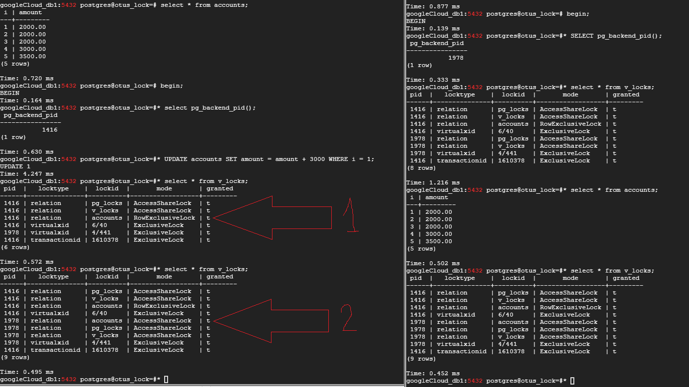

### Домашнее задание № 7 (Блокировки PostgreSQL)

1. Подготовим к домашнему заданию новую БД - <b>otus_lock</b>.

Справочная информация о блокировках:

### pg_locks - (представление) текущие блокировки в БД
 - <b>relation</b>  
Блокировки отношений.

 - <b>transactionid</b> и <b>virtualxid</b>  
Блокировка номера транзакции (настоящего или виртуального). Каждая транзакция сама удерживает исключительную блокировку своего собственного номера, поэтому такие блокировки удобно использовать, когда нужно дождаться окончания другой транзакции.

 - <b>tuple</b>  
Блокировка версии строки. Используется в некоторых случаях для установки приоритета среди нескольких транзакций, ожидающих блокировку одной и той же строки.

 - <b>extend</b>  
Используется при добавлении страниц к файлу какого-либо отношения.

 - <b>object</b>  
Блокировка объектов, которые не являются отношениями (баз данных, схем, подписок и т. п.).

 - <b>page</b>  
Блокировка страницы, используется нечасто и только некоторыми типами индексов.

 - <b>advisory</b>  
Рекомендательная блокировка, устанавливается пользователем вручную.

#### Матрица совместимости блокировок:


### pg_blocking_pids(<i>pid</i>) - (функция) кто блокирует
### log_lock_waits - (параметр)
### max_locks_per_transaction × max_connections - максимальное количество блокировок в системе

>Пул блокировок — общий для всех транзакций, то есть одна транзакция может захватить больше блокировок, чем max_locks_per_transaction: важно лишь, чтобы общее число блокировок в системе не превысило установленный предел. Пул создается при запуске, так что <b>изменение любого из двух указанных параметров требует перезагрузки сервера</b>.

2. Настроим параметры:


Создадим вью <b>v_locks</b>:

 `CREATE VIEW v_locks AS`  
 `SELECT pid,`  
       `locktype,`  
       `CASE locktype`  
         `WHEN 'relation' THEN relation::REGCLASS::text`  
         `WHEN 'virtualxid' THEN virtualxid::text`  
         `WHEN 'transactionid' THEN transactionid::text`  
         `WHEN 'tuple' THEN relation::REGCLASS::text||':'||tuple::text`  
       `END AS lockid,`  
       `mode,`  
       `granted`  
 `FROM pg_locks;`
 
 
 
 Обратимся к нашему вью и увидим следующие блокировки (для каждого сеанса, в данном случае, одинаковые, т.к. происходит только чтение и обращение к одним и тем же отношениям:

 
 
 Мы видим <b>pid</b> нашего процесса, который запросил 3 блокировки (2 блокировки на отношения - наше вью <b>v_locks</b> и таблицу <b>pg_locks</b> + 1 блокировка виртуального номера транзакции) в режиме чтения (<b>AccessShareLock</b>) и получил их - <b>granted</b> = <b>t</b><i>rue</i>
 
 Теперь начнём транзакцию и создадим таблицу <b>accounts</b>:

 `create table accounts(id integer, amount numeric);`  
 
 Эту таблицу мы не увидим в других сессиях (транзакция не закомичена), но увидим какие блокировки получены:


Видим, что по мимо 3-х вышеописанных блокировок, сеанс получил и удерживает (<b>granted t</b>) блокировку в режиме <b>AccessExlusiveLock</b> на созданную таблицу (<b>relation</b>) <b>accounts</b>. Кроме того, транзакция захватила себе блокировку типа <b>transactionid</b> - т.е. наша транзакция теперь имеет реальны (не виртуальный) <b>id</b> - <b>1610376</b>. 
```diff
- Про pg_toast не совсем понятно (возможно это связано с типом данных numeric)?
```

Теперь закоммитим нашу транзакцию (создания таблицы) и убедимся, что блокировки сняты и таблица появилась в базе:


   
3. Заполним таблицу данными:

 `INSERT INTO accounts VALUES (1,2000.00), (2,2000.00), (3,2000.00), (4,3000.00), (5,3500.00);`
 
Начнём транзакцию и обновим строку в таблице <b>accounts</b>:

 `begin;`  
 `update accounts set amount = amount + 3000 where i = 1`
 


(1)Видим, что появилась транзакция с номером <b>1610378</b> (видим строку с <b>transactionid</b>), получившая и удерживающая (<b>granted t</b>) блокировку в режиме <b>RowExclusive</b> на отношение <b>accounts</b>. 
 
Теперь в другом сеансе выбираем все данные из <b>accounts</b>:

`select * from accounts;`

(2)Видим, что появилась блокировка <b>AccessShare</b>, которая, согласно таблице выше, совместима со всеми режимами, кроме <b>AccessExclusive</b>

Следующим шагом попробуем (без коммита транзакци <b>update</b>), построить индекс по полю <b>i</b>:

`create index on accounts(i);`

И наблюдаем "подвисание" команды! А в <b>locks</b> появился запрос блокировки <b>ShareLock</b> (смотрим таблицу совместимости), которая не может быть получена (<b>granted f</b>), пока не будет снята <b>RowExclusive</b>


Завершим транзакцию (<b>1610378</b> <i>update</i>). И тут же можем увидеть, как наша вторая транзакция (<b>create index</b>) получает запрошенную блокировку (<b>ShareLock</b>) и выполняет построение индекса:


Как можно видеть, транзакция по созданию индекса отрабатывала значительно дольше <b>200mc</b> и, согласно нашим настройкам (п.1) должна отобразится в журнале. Что мы и наблюдаем ниже:


4. Теперь смоделируем ситуацию обновления одной и той же строки таблицы <b>accounts</b> тремя разными сеансами:

 `begin;`  
 `select pg_backend_pid();     // 1736`   
 `update accounts set amount = amount - 500 where i = 3;`  
 
 `begin;`  
 `select pg_backend_pid();     // 1749`  
 `update accounts set amount = amount + 1300 where i = 3;`
 
 `begin;`  
 `select pg_backend_pid();     // 1777`  
 `update accounts set amount = amount + 2300 where i = 3;`
 
 
 
 Видим следующее:  
 
 
 
 * Первый сеанс (<b>1736</b>) выполнил обновление, завладев блокировкой <b>RowExclusive</b> (но не зафиксировал транзакцию <b>transactionid 1610380</b>)!  
 * Второй сеанс (<b>1749</b>) тоже завладел блокировкой <b>RowExclusive</b> (смотрим матрицу выше - RowExclusive не блокируют друг друга) и получил номер <b>transactionid 1610381</b>. Но обнаружил, что версия строки заблокирована. Вспоминаем:
  ><b>tuple</b>
  Блокировка версии строки. Используется в некоторых случаях для установки приоритета среди нескольких транзакций, ожидающих блокировку одной и той же строки. 


  

