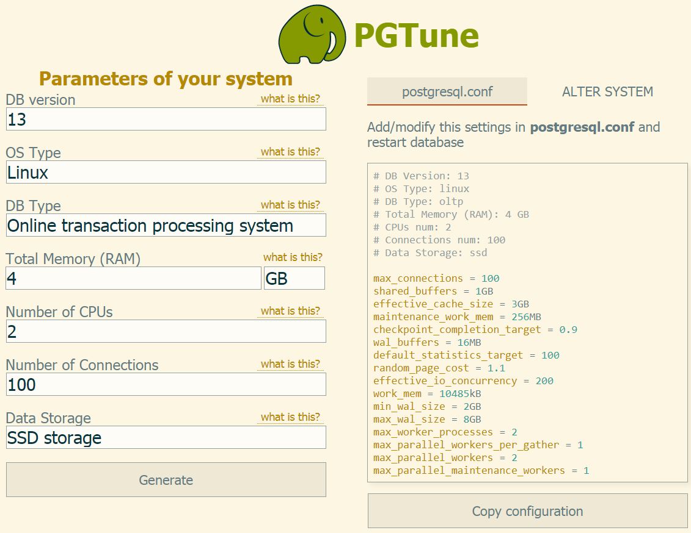
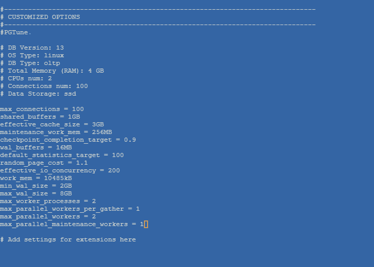
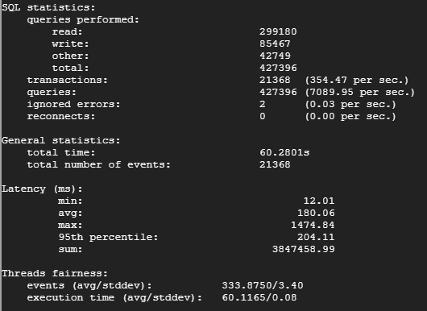
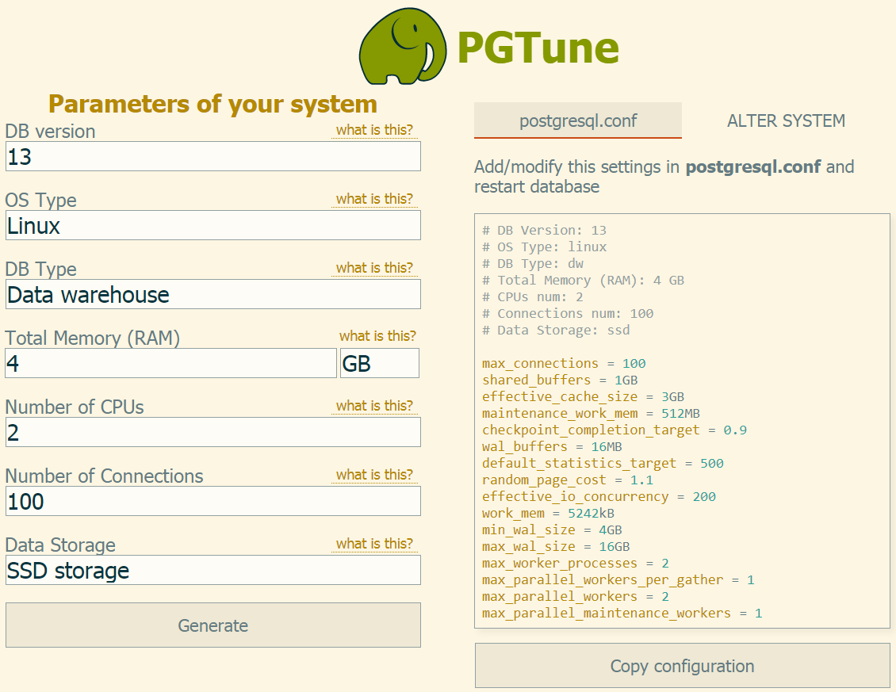
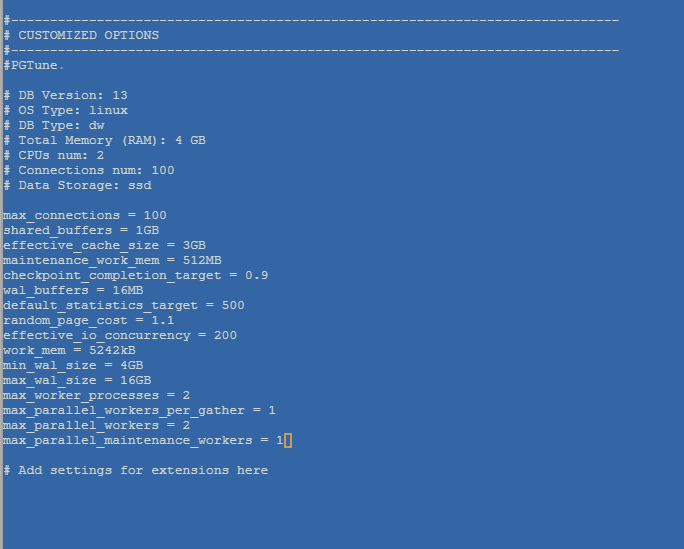
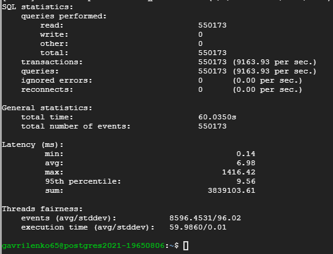

## Домашнее задание № 7 (Настройка PostgreSQL )

#### Ссылки:
https://severalnines.com/database-blog/how-benchmark-postgresql-performance-using-sysbench

1. Установим 13-ю версию PostgreSQL:
 `sudo apt update`  
 `sudo apt -y upgrade`  
 `sudo apt -y install vim bash-completion wget`  
 `wget --quiet -O - https://www.postgresql.org/media/keys/ACCC4CF8.asc | sudo apt-key add -`
 `echo "deb http://apt.postgresql.org/pub/repos/apt/ `lsb_release -cs`-pgdg main" |sudo tee  /etc/apt/sources.list.d/pgdg.list`  
 `sudo apt update`  
 `sudo apt install postgresql-13 postgresql-client-13`  
 `sudo pg_lsclusters //видим 2 запущенных кластера (12 и 13 версии)`  
 `sudo pg_dropcluster 13 main --stop`  
 `sudo pg_upgradecluster 12 main`  
 `sudo apt-get purge postgresql-12 postgresql-client-12`
 
 
 
2. Устанавливаем <b>sysbench-tpcc</b>:

 `curl -s https://packagecloud.io/install/repositories/akopytov/sysbench/script.deb.sh | sudo bash sudo apt -y install sysbench`
 
 >С помощью sysbench вы можете выполнять различные виды рабочей нагрузки базы данных.
 
3. Подготовим данные для теста:

 `CREATE USER sbtest WITH PASSWORD 'password';`  
 `CREATE DATABASE sbtest;`  
 `GRANT ALL PRIVILEGES ON DATABASE sbtest TO sbtest;`  
 
 
 
 
 
4. Инициализируем БД <b>sysbench</b> с помощью скрипта:

 `sudo sysbench \`  
 `--db-driver=pgsql \`  
 `--oltp-table-size=100000 \`  
 `--oltp-tables-count=24 \`  
 `--threads=1 \`  
 `--pgsql-host=127.0.0.1 \`  
 `--pgsql-port=5432 \`  
 `--pgsql-user=sbtest \`  
 `--pgsql-password=password \`  
 `--pgsql-db=sbtest \`  
 `/usr/share/sysbench/tests/include/oltp_legacy/parallel_prepare.lua \`  
 `run`
 
 
 
 
 
 Тестовые данные загружены. Проверяем:

 `psql -U sbtest -W`  
 `\c sbtest;`  
 `\dt+`
 
 

5. Тесты с настройками по умолчанию:

 * <b>read/write</b> (<b>OLTP</b>):

 `sudo sysbench \`  
 `--db-driver=pgsql \`  
 `--report-interval=2 \`  
 `--oltp-table-size=100000 \`  
 `--oltp-tables-count=24 \`  
 `--threads=64 \`  
 `--time=60 \`  
 `--pgsql-host=127.0.0.1 \`  
 `--pgsql-port=5432 \`  
 `--pgsql-user=sbtest \`  
 `--pgsql-password=password \`  
 `--pgsql-db=sbtest \`  
 `/usr/share/sysbench/tests/include/oltp_legacy/oltp.lua \`  
 `run`  
 
 
 
 <b><i>transactions:       15469  (256.05 per sec.)</i></b>
 
 * <b>read only</b>

 `sudo sysbench \`  
 `--db-driver=pgsql \`  
 `--report-interval=2 \`  
 `--oltp-table-size=100000 \`  
 `--oltp-tables-count=24 \`  
 `--threads=64 \`  
 `--time=60 \`  
 `--pgsql-host=127.0.0.1 \`  
 `--pgsql-port=5432 \`  
 `--pgsql-user=sbtest \`  
 `--pgsql-password=password \`  
 `--pgsql-db=sbtest \`  
 `/usr/share/sysbench/tests/include/oltp_legacy/select.lua \`  
 `run`  
 
 
 
 <b><i>transactions:      560463 (9335.38 per sec.)</i></b>

6. Тесты с изменёнными настройками:

Воспользуемся генератором настроек: https://pgtune.leopard.in.ua/

* <b>read/write</b> (<b>OLTP</b>):

<i>max_connections = 100  
shared_buffers = 1GB  # 25% - согласно рекомендации PostgreSQL  
effective_cache_size = 3GB # 75% от общей ОП  
maintenance_work_mem = 256MB # Определяет максимальное количество ОП для операций типа VACUUM, CREATE INDEX, CREATE FOREIGN KEY. Увел
ичение этого параметра позволит быстрее выполнять эти операции  
checkpoint_completion_target = 0.9 # время (в %) записи на диск со старта Chckpt до старта следуещей Chckpt  
wal_buffers = 16MB # Объём разделяемой памяти, который будет использоваться для буферизации данных WAL, ещё не записанных на диск  
default_statistics_target = 100  
random_page_cost = 1.1  
effective_io_concurrency = 200  
work_mem = 52428kB # Используется для сортировок, построения hash таблиц. Это позволяет выполнять данные операции в памяти, что гораз
до быстрее обращения к диску  
min_wal_size = 2GB # Ограничивает снизу число файлов WAL, которые будут переработаны для будущего использования  
max_wal_size = 8GB # Максимальный размер, до которого может вырастать WAL между автоматическими контрольными точками в WAL (если разм
ер достигнут - контрольная точка запускается вне графика)  
max_worker_processes = 2  
max_parallel_workers_per_gather = 1  
max_parallel_workers = 2  
max_parallel_maintenance_workers = 1</i>

<b><i>Не забываем рестартовать кластер!!!</i></b>

Запускаем тест (см. <b>п.5</b>).  

Результаты:

<b><i>transactions:       21368  (354.47 per sec.)</i></b>

* <b>read only</b>:

<i>max_connections = 100  
shared_buffers = 1GB  
effective_cache_size = 3GB  
maintenance_work_mem = 512MB  
checkpoint_completion_target = 0.9  
wal_buffers = 16MB  
default_statistics_target = 500  
random_page_cost = 1.1  
effective_io_concurrency = 200  
work_mem = 5242kB  
min_wal_size = 4GB  
max_wal_size = 16GB  
max_worker_processes = 2  
max_parallel_workers_per_gather = 1  
max_parallel_workers = 2  
max_parallel_maintenance_workers = 1</i>

<b><i>Не забываем рестартовать кластер!!!</i></b>

Запускаем тест (см. <b>п.5</b>).

<b><i>transactions:      550173 (9163.93 per sec.)</i></b>

<b>ИТОГ:</b>

| Left-Aligned  | TPS (Defoult)   | TPS (PGTune) |
| :------------ |:---------------:| ------------:|
| col 3 is      | some wordy text | $1600 |
| col 2 is      | centered        |   $12 |
| zebra stripes | are neat        |    $1 |

#### Ссылки:  
https://github.com/akopytov/sysbench - установка sysbench  
https://severalnines.com/database-blog/how-benchmark-postgresql-performance-using-sysbench - тестирование  
https://pgtune.leopard.in.ua/#/ - PGTune  
