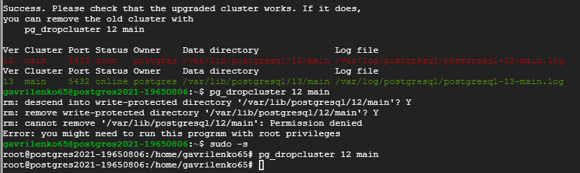
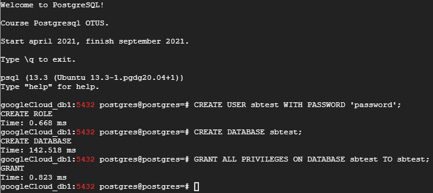
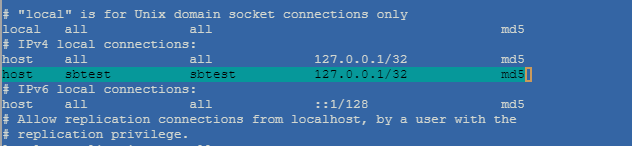
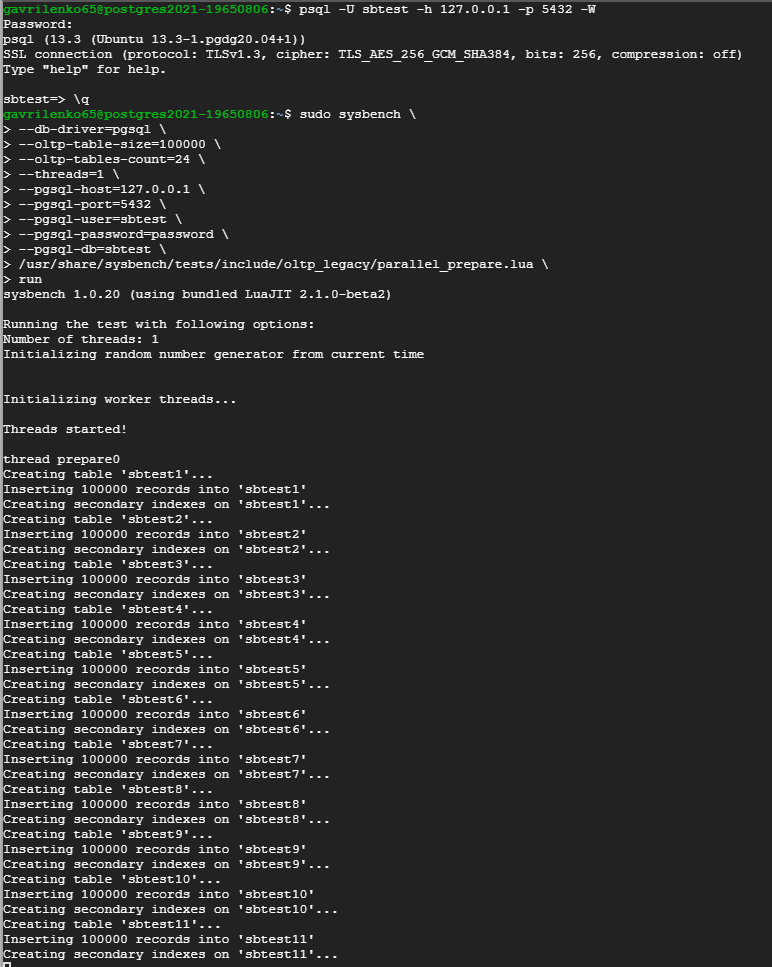
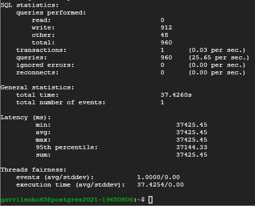
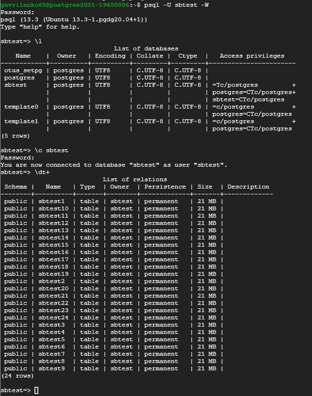
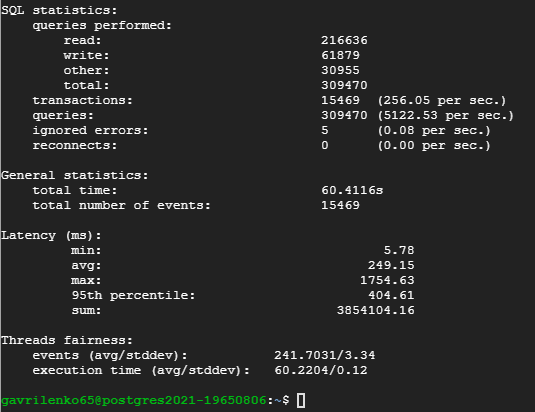
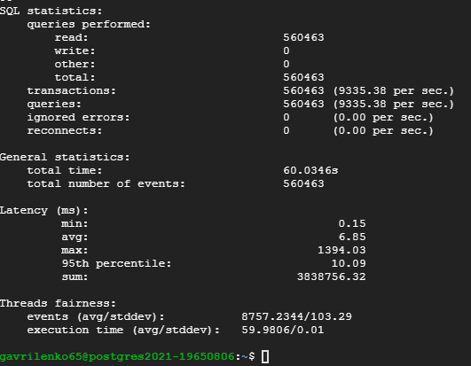

## Домашнее задание № 7 (Настройка PostgreSQL )

#### Ссылки:
https://severalnines.com/database-blog/how-benchmark-postgresql-performance-using-sysbench

1. Установим 13-ю версию PostgreSQL:
 `sudo apt update`  
 `sudo apt -y upgrade`  
 `sudo apt -y install vim bash-completion wget`  
 `wget --quiet -O - https://www.postgresql.org/media/keys/ACCC4CF8.asc | sudo apt-key add -`
 `echo "deb http://apt.postgresql.org/pub/repos/apt/ `lsb_release -cs`-pgdg main" |sudo tee  /etc/apt/sources.list.d/pgdg.list`  
 `sudo apt update`  
 `sudo apt install postgresql-13 postgresql-client-13`  
 `sudo pg_lsclusters //видим 2 запущенных кластера (12 и 13 версии)`  
 `sudo pg_dropcluster 13 main --stop`  
 `sudo pg_upgradecluster 12 main`  
 `sudo apt-get purge postgresql-12 postgresql-client-12`
 
 
 
2. Устанавливаем <b>sysbench-tpcc</b>:

 `curl -s https://packagecloud.io/install/repositories/akopytov/sysbench/script.deb.sh | sudo bash sudo apt -y install sysbench`
 
 >С помощью sysbench вы можете выполнять различные виды рабочей нагрузки базы данных.
 
3. Подготовим данные для теста:

 `CREATE USER sbtest WITH PASSWORD 'password';`  
 `CREATE DATABASE sbtest;`  
 `GRANT ALL PRIVILEGES ON DATABASE sbtest TO sbtest;`  
 
 
 
 
 
4. Инициализируем БД <b>sysbench</b> с помощью скрипта:

 `sudo sysbench \`  
 `--db-driver=pgsql \`  
 `--oltp-table-size=100000 \`  
 `--oltp-tables-count=24 \`  
 `--threads=1 \`  
 `--pgsql-host=127.0.0.1 \`  
 `--pgsql-port=5432 \`  
 `--pgsql-user=sbtest \`  
 `--pgsql-password=password \`  
 `--pgsql-db=sbtest \`  
 `/usr/share/sysbench/tests/include/oltp_legacy/parallel_prepare.lua \`  
 `run`
 
 
 
 
 
 Тестовые данные загружены. Проверяем:

 `psql -U sbtest -W`  
 `\c sbtest;`  
 `\dt+`
 
 

5. Тесты с настройками по умолчанию:

 * <b>read/write</b> (<b>OLTP</b>):

 `sudo sysbench \`  
 `--db-driver=pgsql \`  
 `--report-interval=2 \`  
 `--oltp-table-size=100000 \`  
 `--oltp-tables-count=24 \`  
 `--threads=64 \`  
 `--time=60 \`  
 `--pgsql-host=127.0.0.1 \`  
 `--pgsql-port=5432 \`  
 `--pgsql-user=sbtest \`  
 `--pgsql-password=password \`  
 `--pgsql-db=sbtest \`  
 `/usr/share/sysbench/tests/include/oltp_legacy/oltp.lua \`  
 `run`  
 
 
 
 * <b>read only</b>

 `sudo sysbench \`  
 `--db-driver=pgsql \`  
 `--report-interval=2 \`  
 `--oltp-table-size=100000 \`  
 `--oltp-tables-count=24 \`  
 `--threads=64 \`  
 `--time=60 \`  
 `--pgsql-host=127.0.0.1 \`  
 `--pgsql-port=5432 \`  
 `--pgsql-user=sbtest \`  
 `--pgsql-password=password \`  
 `--pgsql-db=sbtest \`  
 `/usr/share/sysbench/tests/include/oltp_legacy/select.lua \`  
 `run`  
 
 

6. Тесты с изменёнными настройками:
 
 

#### Ссылки:  
https://github.com/akopytov/sysbench - установка sysbench  
https://severalnines.com/database-blog/how-benchmark-postgresql-performance-using-sysbench - тестирование  
https://pgtune.leopard.in.ua/#/ - PGTune  
